# Chapter 01 — Calibre Basic Concepts

> **Learning Objectives:** By the end of this chapter, you will be able to:
> - Explain how Calibre physical verification fits into an IC design flow
> - Describe the overall Calibre physical verification process flow
> - Name the various types of SVRF files used by Calibre
> - List important attributes of the SVRF language

---

## 1. What is Calibre?

Calibre is an industry-leading **physical verification tool** developed by Siemens EDA (formerly Mentor Graphics). It is used in the semiconductor industry to verify that an IC (Integrated Circuit) layout is correct before sending it to fabrication.

There are two core verification tasks Calibre performs:

- **DRC (Design Rule Checking)** — Checks that the physical layout follows the manufacturing rules set by the foundry (chip factory). If your metal lines are too close together, or a shape is too small, DRC will flag it.
- **LVS (Layout vs. Schematic)** — Compares the layout you drew against your original circuit schematic to ensure they match electrically.

Think of it this way:
> DRC = "Is the layout manufacturable?" | LVS = "Does the layout match the design intent?"

---

## 2. Various Calibre Tools

Calibre is not a single tool — it is a **suite of tools** that work together:

| Tool | Purpose |
|------|---------|
| **Calibre nmDRC** | Runs Design Rule Checks on the layout |
| **Calibre nmLVS** | Runs Layout vs. Schematic verification |
| **Calibre RVE** | Results Viewing Environment — displays verification results |
| **Calibre Interactive™** | GUI frontend to set up and run Calibre jobs |
| **Calibre DESIGNrev™** | Layout viewer used to open and inspect GDS files |
| **Calibre PEX tools** | Parasitic extraction |
| **Calibre MDP** | Mask Data Preparation |
| **Calibre RET tools** | Resolution Enhancement Technology |
| **Calibre DFM** | Design for Manufacturability |

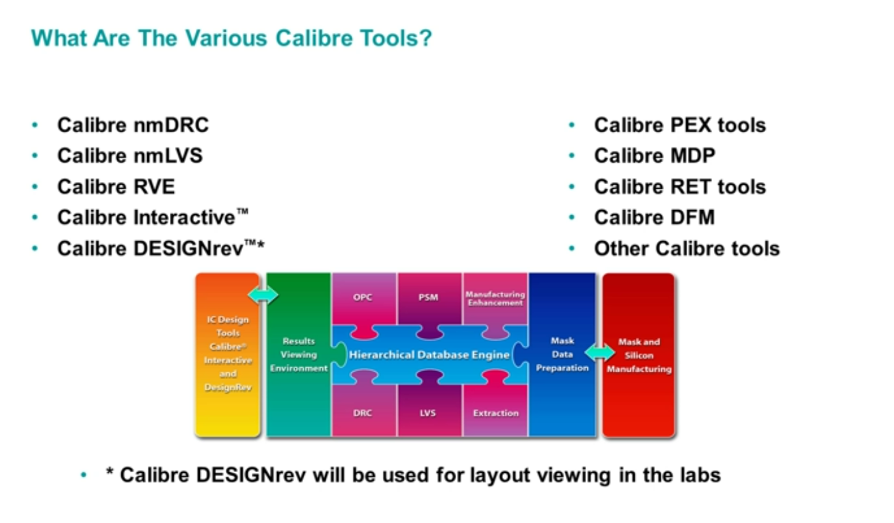

> 💡 **Note:** In labs, **Calibre DESIGNrev** is used for layout viewing. It is the entry point from which you launch Calibre Interactive.

---

## 3. How Calibre Fits Into the IC Design Flow

IC design is a multi-step process. Here is where Calibre fits in:

1. **Netlist** — The designer creates a circuit schematic which generates a netlist (list of components and connections)
2. **Simulation** — The netlist is simulated to verify electrical behavior
3. **Layout** — The circuit is translated into physical shapes on silicon layers, using either:
   - **Automated Layout** (place-and-route tools)
   - **Full Custom Editing** (manual layout drawing)
4. **Calibre Physical Verification** — The layout is checked using Calibre DRC and LVS

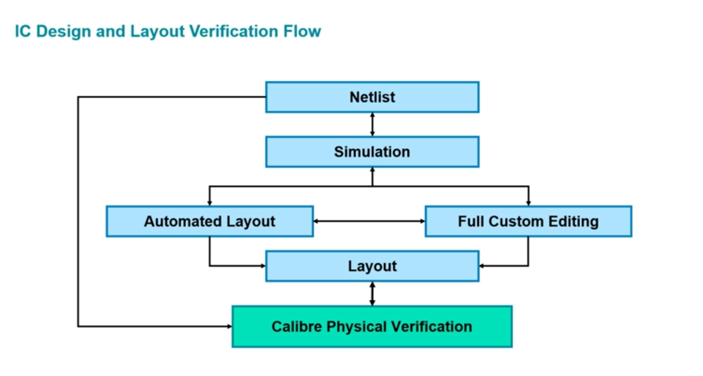

> ⚠️ **Important:** If Calibre finds errors, the designer must go back and fix the layout, then re-run verification. This loop continues until the layout is clean (zero errors).

---

## 4. Basic Calibre Process Flow

The overall Calibre process connects multiple components:

- The **Foundry** provides SVRF rule files (packaged in the PDK — Process Design Kit)
- The **User** provides the layout data (GDS file) and job-specific settings
- **Calibre nmDRC/nmLVS** is the engine that processes everything and produces output
- **Calibre RVE** is used to view the results
- **Calibre DESIGNrev** is the layout viewer that ties everything together

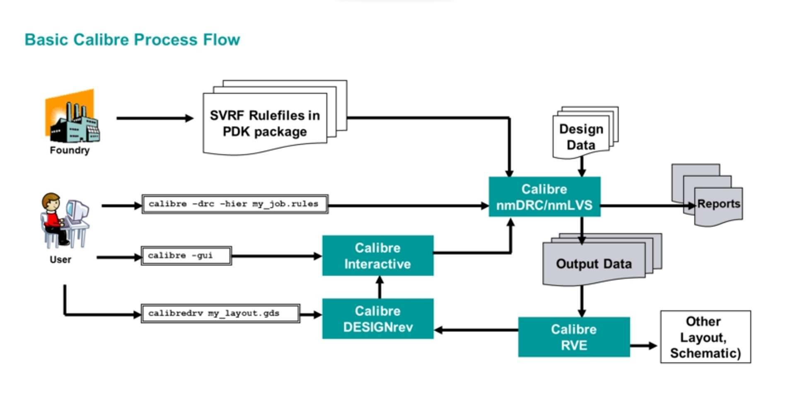

### Key Commands in This Flow:

```bash
# Run DRC from command line (hierarchical mode)
calibre -drc -hier my_job.rules

# Launch Calibre GUI
calibre -gui

# Open Calibre DESIGNrev layout viewer
calibredrv my_layout.gds
```

> 💡 **Tip:** Do NOT use `&` at the end of the `calibredrv` command — it will cause DESIGNrev to not work properly.

---

## 5. Calibre Glossary — Key Terms

Before going deeper, here are the essential terms you MUST know:

| Term | Full Form | What It Means |
|------|-----------|---------------|
| **SVRF** | Standard Verification Rule Format | The command language used by ALL Calibre applications |
| **Rule Check** | — | A DRC check that creates result database output when layout meets specified criteria |
| **RDB** | Results Database | An ASCII file containing verification results with optional properties |
| **SVDB** | Standard Verification Database | All directories and files created during a Calibre nmLVS run |
| **RVE** | Results Viewing Environment | The Calibre tool used to view physical verification results |

---

## 6. What is SVRF?

**SVRF (Standard Verification Rule Format)** is the scripting/command language that Calibre uses for ALL its operations. Think of it as the "programming language of Calibre."

### What Goes Inside an SVRF File?

SVRF files contain two main categories of information:

**Category 1 — Technology Specific Instructions (from the Foundry/PDK):**
- DRC Rules (e.g., minimum metal width, minimum spacing between layers)
- LVS connectivity and device recognition rules

**Category 2 — Job and User Specific Setup (from the User):**
- I/O file specifications (where is your layout? where should results go?)
- User-specified job options (run type, output format, etc.)

### What SVRF Does NOT Specify:
- Run type — flat or hierarchical (specified via command line switch)
- Use of multiple processors or networked computers
- LVS job type — layout netlist extraction, netlist compare, or both
- Name of extracted layout netlist file (LVS)
- Hierarchical cell list file name (LVS)

These are handled through **command line switches** or the **Calibre Interactive GUI**.

---

## 7. Types of SVRF Files

A single Calibre run can use **multiple SVRF files**. Calibre merges them all into one at runtime. There are three types:

### 7.1 Process Rule File
- Provided by the **foundry** (chip manufacturer)
- Contains all the technology-specific DRC and LVS rules
- **Never (or rarely) edited by the user**
- Comes as part of the PDK package

### 7.2 Job SVRF File
- Created and managed by the **user**
- Contains job-specific information such as:
  - Location of source and layout files
  - Report file names
  - Results database specification
- Example entries:
  ```
  LAYOUT PATH "demo.gds"
  LAYOUT PRIMARY "TOP"
  LAYOUT SYSTEM GDSII
  DRC RESULTS DATABASE "demo_drc.db" ASCII
  INCLUDE "golden_rules"
  ```

### 7.3 User SVRF File
- Optional, created by the user for specific runs
- Examples of use:
  - Selecting or deselecting specific DRC checks
  - Specifying parallel transistor reduction for LVS

> 💡 **Key Point:** At runtime, Calibre **merges all SVRF files** into a single combined file before execution. You don't need to put everything in one file!

---

## 8. How to Specify Calibre Instructions

There are three ways to create and provide SVRF instructions to Calibre:

### Option 1: Text Editor (Manual Entry)
- Directly edit SVRF files using any text editor
- Specify needed switch values on the command line
- Best for power users and automation scripts

### Option 2: Calibre Interactive GUI
- Fill in GUI forms — Calibre automatically generates the SVRF and command line
- The GUI builds the command based on your choices
- Best for beginners and interactive use

### Option 3: Custom GUI
- Similar to Calibre Interactive but customized per customer/company
- Details and capabilities vary by organization

---

## 9. Using Calibre GUI — Calibre Interactive

**Calibre Interactive** is the graphical interface for setting up and running Calibre jobs. It is the most common way beginners interact with Calibre.

### How to Launch Calibre Interactive:

**From command line:**
```bash
# Launch DRC GUI
calibre -gui -drc

# Launch DRC GUI with a pre-loaded runset
calibre -gui -drc demo_runset
```

**From Calibre DESIGNrev:**
- Go to **Verification menu → Run nmDRC...** (or Run nmLVS...)

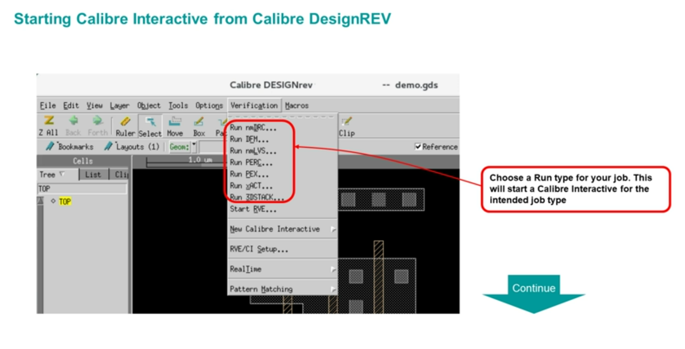

### Calibre Interactive Flow Overview

The GUI works like this:
1. You (or a runset file) provide settings via the GUI forms
2. The GUI generates a rule file and builds a command line
3. The command line invokes **Calibre nmDRC** (the actual engine)

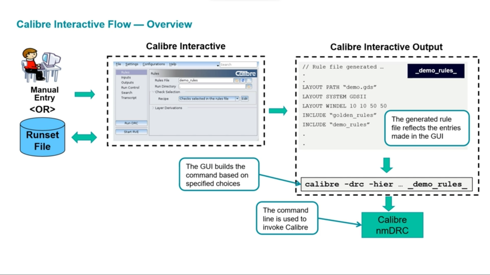

### Calibre Interactive DRC — Key Features

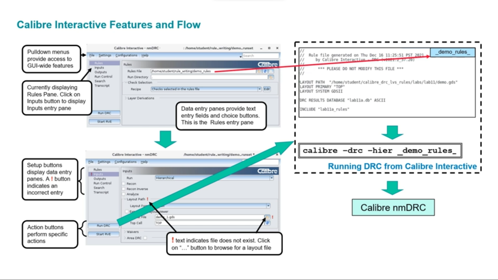

The GUI has several panels:
- **Rules panel** — Specify the rules file and run directory
- **Inputs panel** — Specify the layout file (GDS), top cell name, run type (Hierarchical/Flat)
- **Outputs panel** — Specify where results go
- **Run Control panel** — Choose where to run (local host, remote), number of CPUs
- **Transcript panel** — Shows live output as Calibre runs

> ⚠️ **Important:** A `!` (exclamation mark) icon next to a field means that entry is incorrect or the file does not exist. Always resolve these before running.

### What is a Runset File?

A **runset file** saves all your GUI settings so you can reload them later. It stores settings like:
```
*drcRulesFile: demo_rules
*drcLayoutPaths: demo.gds
*drcLayoutPrimary: TOP
*drcResultsFile: demo_drc.db
*drcWriteSummary: 0
*drcSummaryFile: TOP.drc.summary
```

Launch with a pre-loaded runset:
```bash
calibre -gui -drc demo_runset
```

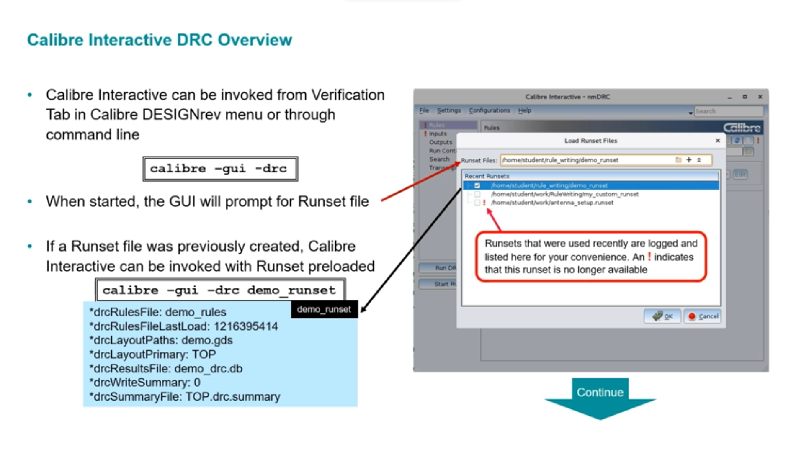

---

## 10. Calibre DESIGNrev — Layout Viewer

**Calibre DESIGNrev** is used to open and view layout (GDS) files. It is also the launching point for Calibre Interactive.

### How to Open a Layout:
```bash
# Change to the directory containing your layout file first
cd /path/to/layout/

# Then open the layout
calibredrv lab1.gds
```

> ⚠️ **Warning:** Do NOT use `&` at the end — this will cause DESIGNrev to not function correctly.

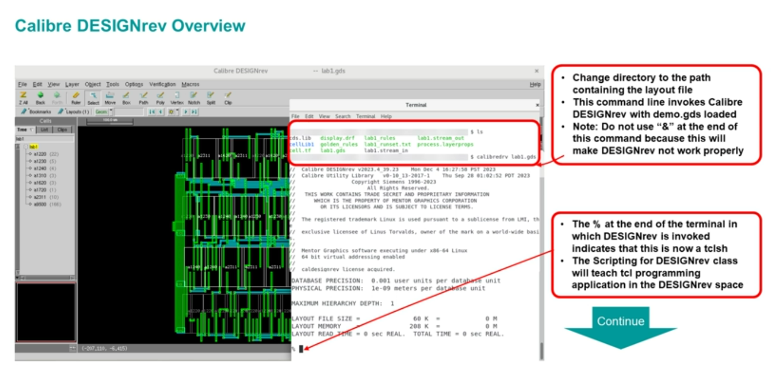

> 💡 **Note:** The `%` symbol at the terminal prompt after launching DESIGNrev indicates it is now running in `tcsh` shell mode.

---

## 11. Viewing Results with Calibre RVE

After running DRC/LVS, results are stored in a **Results Database (RDB)** file. To view them, use **Calibre RVE**.

### How to Launch RVE:

**From command line:**
```bash
# Find the results file in your rules file
grep "DRC RESULTS" demo.rules
# Output: DRC RESULTS DATABASE demo_drc.db

# Then launch RVE
calibre -rve demo_drc.db
```

**From Calibre Interactive:**
- Click **"Start RVE"** button in the GUI
- Or set it to auto-launch after DRC completes in Run Control settings

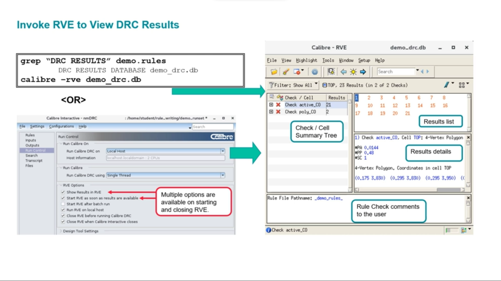

### What You See in RVE:

- **Check/Cell Summary Tree** — Lists all DRC checks and how many errors each has
- **Results List** — Shows individual error instances (numbered)
- **Results Details** — Shows coordinates, area, perimeter of each error polygon
- **Rule File Comments** — Shows notes the rule file author left about each check

---

## 12. Search Toolbar in Calibre Interactive

Calibre Interactive has a built-in **search function** to quickly find settings:

- Press `Ctrl+F` or click the Search field in the top-right corner of the GUI
- Type any runset option name or keyword
- The toolbar finds matches based on the currently active GUI page

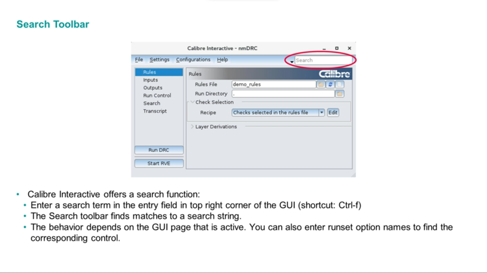

---

## 13. Accessing Online Documentation

Calibre has comprehensive online documentation available through the **InfoHub**.

### Two Ways to Access:

**Option 1 — From command line:**
```bash
mgcdocs
```

**Option 2 — From Calibre Interactive GUI:**
- Click **Help menu → Help and Manuals**
- This opens the **InfoHub PDF Bookcase**

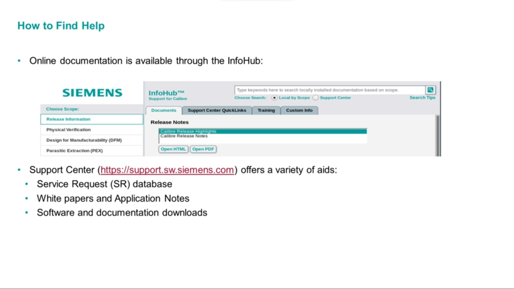

### Support Resources:
- **InfoHub** — Local documentation installed with Calibre
- **Support Center** — [https://support.sw.siemens.com](https://support.sw.siemens.com)
  - Service Request (SR) database
  - White papers and Application Notes
  - Software and documentation downloads

---

## 14. Using Calibre With Other Design Tools (Cross-Probing)

When using **3rd-party layout tools** (like Virtuoso, IC Station), you can set up **cross-probing** — clicking an error in RVE highlights it in your layout tool.

### Setup: Go to RVE → Setup > Options → Design Tools

**For a Layout Design Tool:**
- Enable **"Layout Design Tool"** option
- Enter Host Name and Socket Number

**For a Schematic Design Tool:**
- Enable **"Schematic Design Tool"** option
- Select your tool from the dropdown (Cadence Composer, Synopsys, etc.)

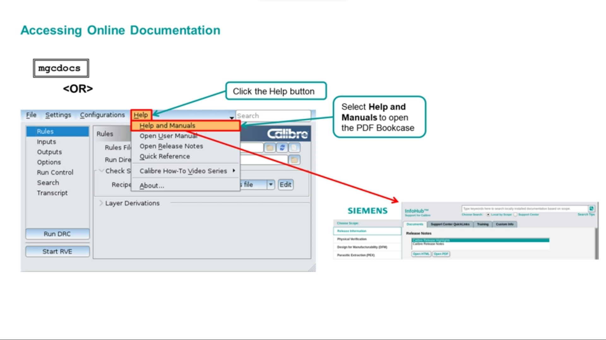
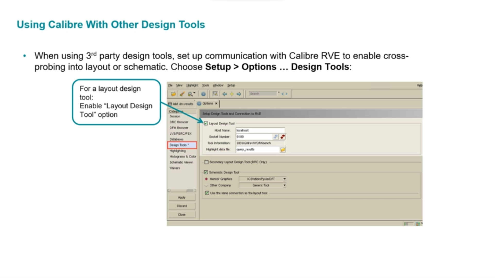

---

## 15. Virtuoso Flow — Integration with Cadence Virtuoso

If you use **Cadence Virtuoso** as your layout editor, here is how the Calibre integration works:

1. In Virtuoso, go to **Calibre → Run DRC** (or Run LVS)
2. Virtuoso streams the layout out from virtual memory into a GDS file
3. Calibre runs on that GDS file
4. Results appear in RVE with cross-probing back to Virtuoso

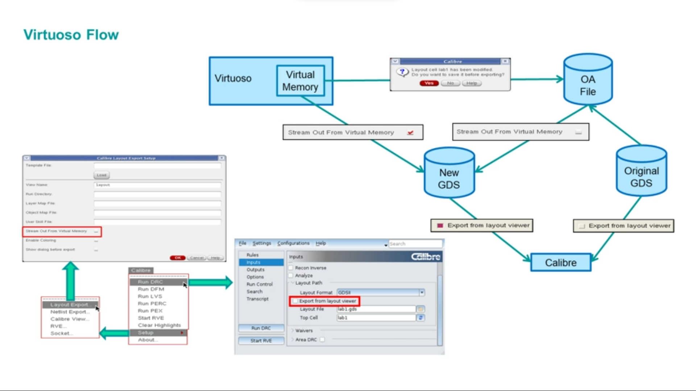

> 💡 **Tip:** Enable **"Export from layout viewer"** in Calibre Interactive's Inputs panel to automatically stream the layout from Virtuoso instead of specifying a static GDS file.

---

## Chapter Summary

| Concept | Key Takeaway |
|---------|-------------|
| Calibre DRC | Checks layout against foundry manufacturing rules |
| Calibre LVS | Compares layout to schematic |
| SVRF | The language/format Calibre uses for all instructions |
| Process SVRF | From foundry — contains technology rules, don't edit |
| Job SVRF | From user — specifies files and job options |
| Runset | Saved GUI settings for reuse |
| RVE | Tool to view DRC/LVS results |
| DESIGNrev | Layout viewer, launches Calibre Interactive |
| InfoHub | Online documentation portal |

---

*Next Chapter: [Chapter 02 — Calibre nmDRC Basics](../chapter-02/)*
