# Chapter 02 — Calibre nmDRC Basics

> **Learning Objectives:** By the end of this chapter, you will be able to:
> - Set up and execute a Calibre nmDRC job using the GUI and SVRF rule file
> - Review and interpret the run transcript and DRC Summary Report
> - Use Calibre RVE to browse, cross-probe, and manage DRC results

---

## Table of Contents

1. [What is Calibre nmDRC?](#1-what-is-calibre-nmdrc)
2. [nmDRC Layout Verification Process Flow](#2-nmdrc-layout-verification-process-flow)
3. [Part 1 — Set Up an nmDRC Run](#part-1--set-up-an-nmdrc-run)
   - 3.1 [Executing a Calibre nmDRC Job — Overview](#31-executing-a-calibre-nmdrc-job--overview)
   - 3.2 [Step 1 — Specify the Rule File](#32-step-1--specify-the-rule-file)
   - 3.3 [Step 2 — Specify Input Information](#33-step-2--specify-input-information)
   - 3.4 [Step 3 — Specify Output Information](#34-step-3--specify-output-information)
   - 3.5 [Step 4 — Specify nmDRC Options](#35-step-4--specify-nmdrc-options)
   - 3.6 [Step 5 — Include Another SVRF File](#36-step-5--include-another-svrf-file)
   - 3.7 [Step 6 — Execute the nmDRC Job](#37-step-6--execute-the-nmdrc-job)
4. [Part 2 — DRC Output Results](#part-2--drc-output-results)
   - 4.1 [Review the Transcript](#41-review-the-transcript)
   - 4.2 [Review the DRC Summary Report](#42-review-the-drc-summary-report)
   - 4.3 [Invoke RVE to View DRC Results](#43-invoke-rve-to-view-drc-results)
5. [Part 3 — Common DRC RVE Tasks](#part-3--common-drc-rve-tasks)
   - 5.1 [Modify RVE Check/Cell Tree Display](#51-modify-rve-checkcell-tree-display)
   - 5.2 [Cross-Probe DRC Results to Layout Viewer](#52-cross-probe-drc-results-to-layout-viewer)
   - 5.3 [Displaying Errors in a Hierarchical Design](#53-displaying-errors-in-a-hierarchical-design)
   - 5.4 [Report Errors in Cell Space](#54-report-errors-in-cell-space)
   - 5.5 [What If the Error Is Still at the Top Level?](#55-what-if-the-error-is-still-at-the-top-level)
   - 5.6 [Set DRC Result Display Format](#56-set-drc-result-display-format)
   - 5.7 [Set DRC Result Status](#57-set-drc-result-status)
   - 5.8 [Comment and View Waived Results](#58-comment-and-view-waived-results)
6. [Chapter Summary](#6-chapter-summary)
7. [Quick Reference — Job Settings SVRF File](#7-quick-reference--job-settings-svrf-file)

---

## 1. What is Calibre nmDRC?

**Calibre nmDRC** (nanometer Design Rule Check) is Siemens EDA's tool for automatically verifying that your IC layout obeys every manufacturing rule defined by the foundry. Think of it as a spell-checker — but instead of grammar, it checks physical geometry on silicon.

When you design a chip, every layer (metal, poly, diffusion, contacts, etc.) must follow strict rules:
- Minimum wire **width** — a wire cannot be too narrow or it breaks during fabrication
- Minimum **spacing** between wires — wires too close together may short-circuit
- Minimum **enclosure** — a via must be fully enclosed by the metal above and below it

If any of these rules are violated, **Calibre nmDRC finds them and reports their exact locations** so you can fix them before sending the design to the fab.

---

## 2. nmDRC Layout Verification Process Flow

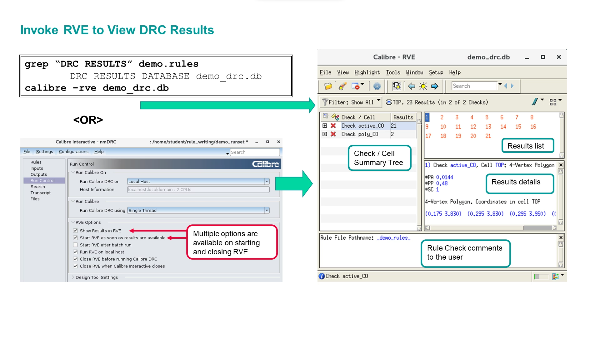

The diagram above shows the complete DRC verification loop. Here is what each step means:

| Step | Component | What happens |
|------|-----------|-------------|
| 1 | **Layout** | Your chip design (stored as a `.gds` GDSII file) |
| 2 | **Rule File** | Foundry-provided SVRF file containing all manufacturing rules |
| 3 | **Calibre nmDRC** | The engine — reads the layout and rule file, runs all checks |
| 4 | **DRC Report** | Optional text summary (dashed border = optional) |
| 5 | **DRC Results Database** | Output file with exact geometric locations of all violations |
| 6 | **Locate errors (RVE + Layout tool)** | Browse violations interactively and see them in your layout |
| 7 | **Fix layout errors** | Edit the layout to correct violations, then re-run DRC |

> ⚠️ **This is an iterative loop.** You keep fixing and re-running until the design has zero DRC violations — only then is it ready for tapeout.

---

## Part 1 — Set Up an nmDRC Run

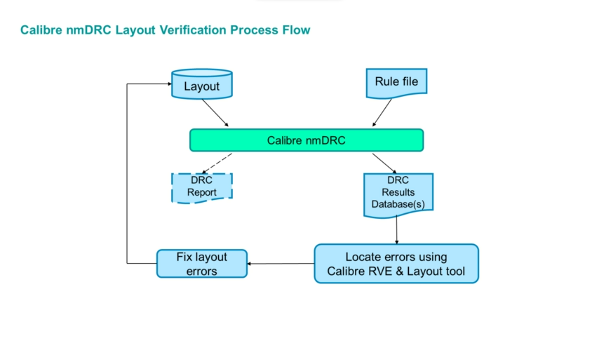

**Learning objectives for Part 1:**

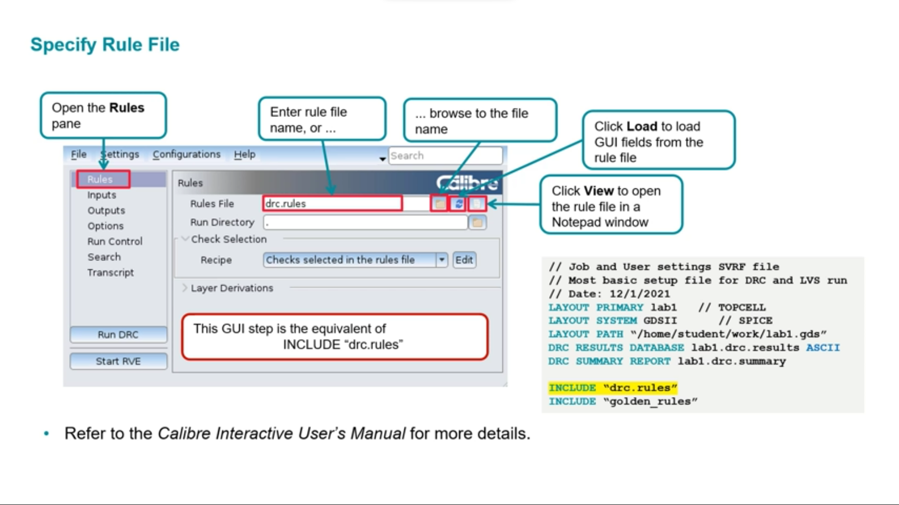

- Specify rule files
- Specify input and output information
- Specify nmDRC options

---

### 3.1 Executing a Calibre nmDRC Job — Overview

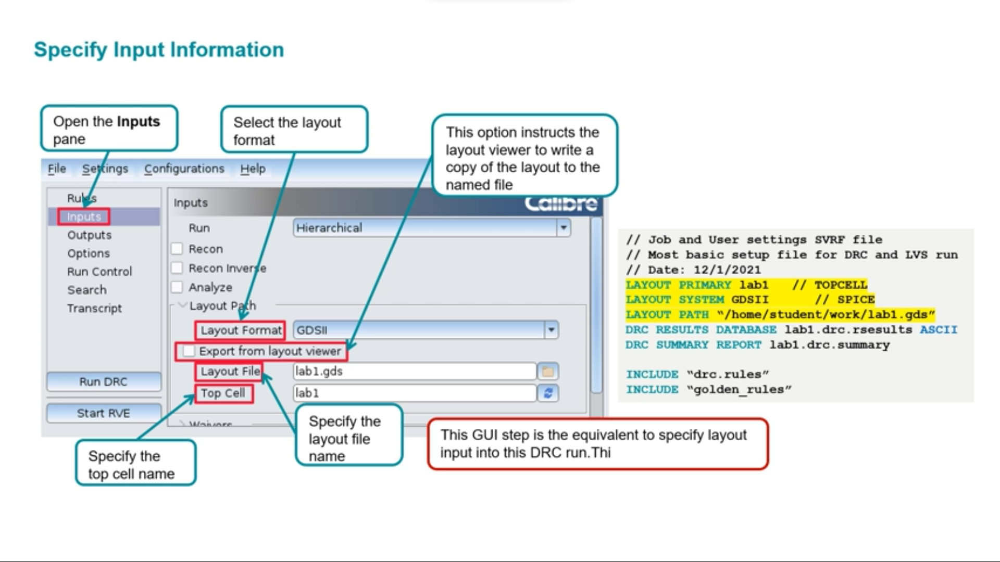

Every nmDRC run follows these five tasks in order:

| # | Task | What it means |
|---|------|--------------|
| 1 | Specify rule file | Point Calibre to the foundry `.rules` file |
| 2 | Specify input information | Provide the layout file path and top cell name |
| 3 | Specify output information | Set result database and summary report file names |
| 4 | Specify nmDRC job options | Set parameters like max results per check |
| 5 | Execute nmDRC job | Click Run DRC or invoke from command line |

#### Two ways to configure a run

**Method A — Calibre Interactive GUI**
Fill in graphical forms. The GUI generates SVRF commands behind the scenes. Best for beginners and interactive use.

**Method B — SVRF Job Rule File (command line)**
Write the settings directly in a text file, then launch Calibre from the terminal. Best for automation and batch runs.

> 💡 **Both methods are equivalent.** Every GUI field has a corresponding SVRF command. This chapter shows both side by side.

#### The minimal SVRF runset file

```svrf
// Job and User settings SVRF file
// Most basic setup file for DRC run
// Date: 12/1/2021
LAYOUT PRIMARY lab1     // TOPCELL
LAYOUT SYSTEM GDSII     // file format
LAYOUT PATH "/home/student/work/lab1.gds"
DRC RESULTS DATABASE lab1.drc.results ASCII
DRC SUMMARY REPORT lab1.drc.summary

INCLUDE "drc.rules"
INCLUDE "golden_rules"
```

Each line will be explained in the steps below.

---

### 3.2 Step 1 — Specify the Rule File

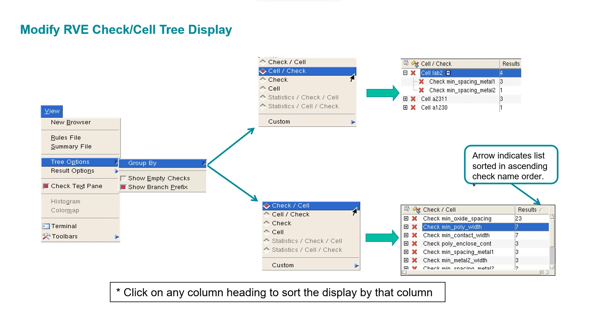

The **Rules pane** is where you point Calibre to the foundry's rule file.

#### How to do it in the GUI

1. Click **Rules** in the left navigation panel
2. In the **Rules File** field, type the file name (e.g., `drc.rules`) or browse to it using the folder icon
3. Click **Load** — this reads the rule file and populates other GUI fields from its contents
4. Optionally click **View** to open the rule file in a Notepad window for inspection

The **Check Selection / Recipe** field lets you run only a specific subset of checks defined in the rule file.

#### Equivalent SVRF command

```svrf
INCLUDE "drc.rules"
```

> 📌 The GUI "Rules File" field is simply a visual wrapper around the `INCLUDE` statement. When you type `drc.rules` in the GUI and click Run DRC, Calibre internally generates `INCLUDE "drc.rules"`.

---

### 3.3 Step 2 — Specify Input Information

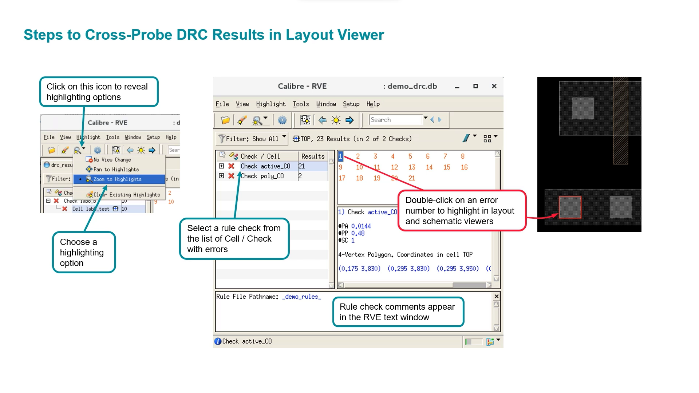

The **Inputs pane** tells Calibre what layout to check.

#### How to do it in the GUI

1. Click **Inputs** in the left navigation panel
2. Set **Layout Format** — almost always `GDSII`
3. Set **Layout File** — the path to your `.gds` file (e.g., `lab1.gds`)
4. Set **Top Cell** — the name of the top-level cell in your design (e.g., `lab1`)
5. Optionally enable **Export from layout viewer** — when checked, the layout viewer (e.g., Virtuoso) automatically writes a fresh copy of the layout to disk before the run, so Calibre always sees your latest edits

#### What is a "Top Cell"?

IC layouts are hierarchical — like a tree. The **Top Cell** is the root of that tree and represents your entire design. Calibre starts there and traverses downward through all subcells.

#### Equivalent SVRF commands

```svrf
LAYOUT PRIMARY lab1               // top cell name
LAYOUT SYSTEM GDSII               // layout file format
LAYOUT PATH "/home/student/work/lab1.gds"  // file location
```

---

### 3.4 Step 3 — Specify Output Information

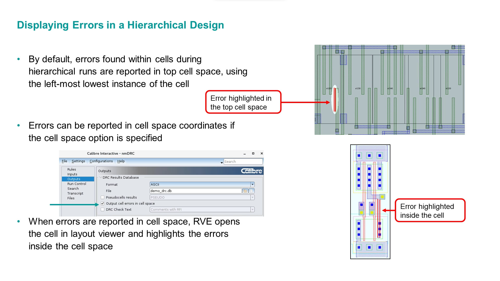

The **Outputs pane** controls where Calibre writes its results. There are two output files to configure:

#### A) DRC Results Database — the primary output

Contains every violation found, with exact geometric coordinates.

- **Format** — `ASCII` (human-readable text, larger file) or binary (smaller, faster)
- **File** — output file name, e.g., `lab1.drc.results`

#### B) DRC Summary Report — optional but recommended

A structured text overview of the entire run.

- Enable by checking **DRC Summary Report**
- Set a file name, e.g., `lab1.drc.summary`
- Set **Previous contents** to `REPLACE` to overwrite old reports on each run
- Check **View DRC Summary Report after run finishes** to auto-open it when the run completes

#### Other notable options

| Option | What it does |
|--------|-------------|
| Output cell errors in cell space | Report errors in the local coordinates of the cell (recommended — explained in Section 5.3) |
| Side RDBs | Create additional results databases for specific checks |
| Create HTML Report | Generate a web-browser-friendly version of results |

#### Equivalent SVRF commands

```svrf
DRC RESULTS DATABASE lab1.drc.results ASCII
DRC SUMMARY REPORT lab1.drc.summary
```

---

### 3.5 Step 4 — Specify nmDRC Options

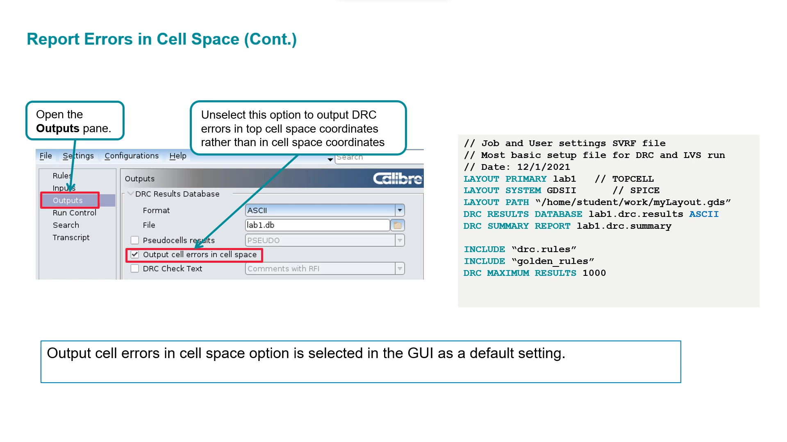

The **Options pane** provides fine-grained control over how the DRC run behaves.

#### How to access it in the GUI

1. Go to **Settings → Show Pages → Options** to make Options visible in the left panel
2. Click **Options** in the left navigation panel
3. Select the desired tab within the Options pane

#### Example — DRC Maximum Results

The most commonly set option is **DRC Maximum Results** — it limits how many violations Calibre stores per rule check.

**Why limit results?** If a systematic error causes 500,000 violations of the same rule, storing all of them wastes disk space. Setting a limit of 1000 gives you enough representative examples to diagnose and fix the root cause.

In the GUI: enable **DRC Maximum Results ✓**, set Upper Limit to `Count`, enter `1000` in Maximum Result Count.

#### Equivalent SVRF command

```svrf
DRC MAXIMUM RESULTS 1000
```

> ⚠️ Not all SVRF options are available in the GUI. If you need an option you cannot find in the Options pane, consult the **SVRF Reference Manual** and add it directly to your runset file.

---

### 3.6 Step 5 — Include Another SVRF File

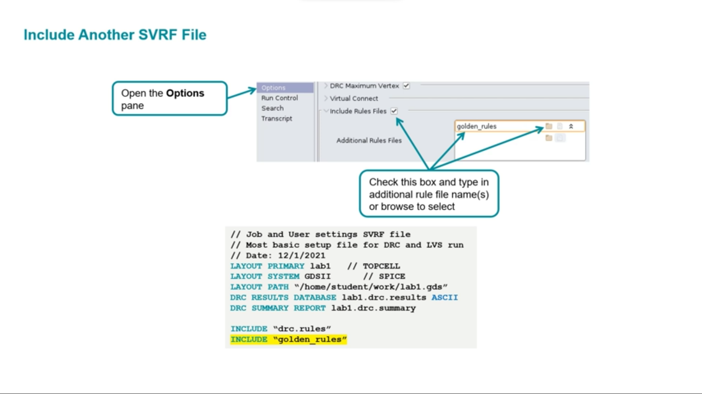

Sometimes you need to include more than one rule file — for example, the foundry's main `drc.rules` plus a supplemental `golden_rules` file.

#### How to do it in the GUI

1. Open the **Options** pane
2. Scroll to **Include Rules Files** and check the checkbox ✓
3. In the **Additional Rules Files** box, type the extra file name (e.g., `golden_rules`) or browse to it

#### Equivalent SVRF command

```svrf
INCLUDE "golden_rules"
```

You can have as many `INCLUDE` statements as needed. They are processed in order, top to bottom.

---

### 3.7 Step 6 — Execute the nmDRC Job

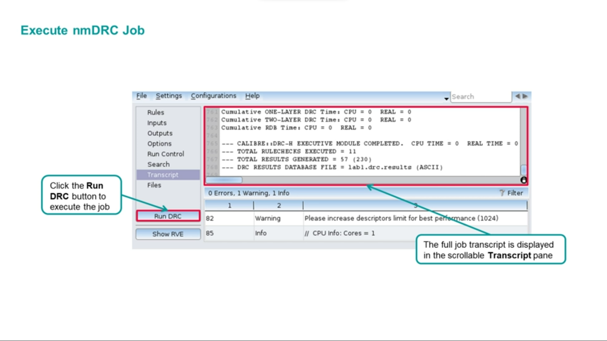

Once all settings are configured, click **Run DRC** at the bottom of the left panel.

#### What happens after clicking Run DRC

- The **Transcript pane** opens and shows the live log as the run progresses
- When complete, a summary line appears below the transcript:
  ```
  0 Errors, 1 Warning, 1 Info
  ```
- Warnings and info messages appear in a table (e.g., memory tuning suggestions)

#### Key statistics at the end of the transcript

```
--- TOTAL RULECHECKS EXECUTED = 11
--- TOTAL RESULTS GENERATED = 57 (230)
--- DRC RESULTS DATABASE FILE = lab1.drc.results (ASCII)
```

| Field | Meaning |
|-------|---------|
| TOTAL RULECHECKS EXECUTED | Number of individual rules that were checked |
| TOTAL RESULTS GENERATED = 57 (230) | 57 stored in database; 230 was the actual count before the 1000-result limit |
| DRC RESULTS DATABASE FILE | Confirms where the output was written |

---

## Part 2 — DRC Output Results

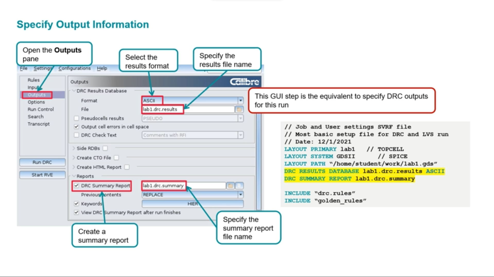

**Learning objectives for Part 2:**

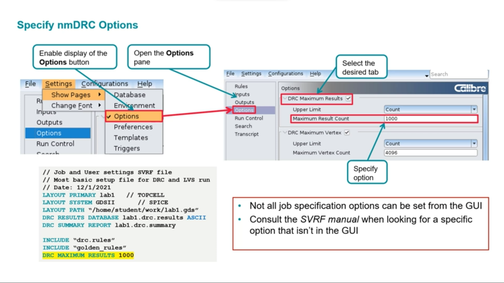

- Review run transcript
- Review DRC Summary Report
- View DRC results in RVE

---

### Reviewing nmDRC Job Output — Overview


After the job finishes, there are three output review tasks:

| Task | Tool | What you learn |
|------|------|---------------|
| Review the Transcript | Terminal or GUI Transcript pane | Execution details, warnings, timing, expansion info |
| Review the DRC Summary Report | Text editor or GUI Files pane | Which rules were checked and how many violations each has |
| View results in RVE | Calibre RVE | Interactive graphical error browser with layout cross-probing |

---

### 4.1 Review the Transcript

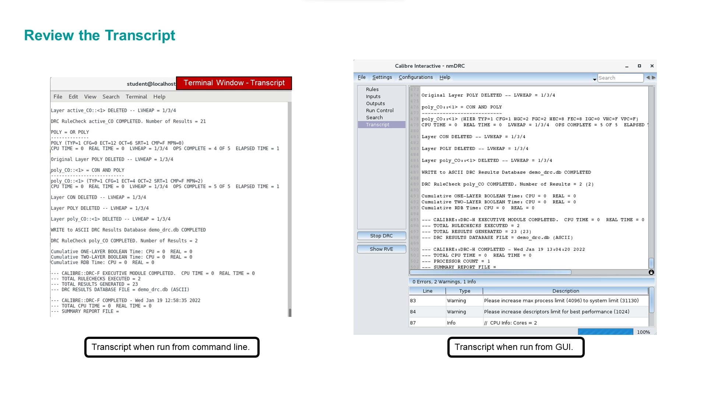

The **transcript** is a detailed real-time log of everything Calibre did during the run. It is the first place to check if something goes wrong.

#### Two places to read the transcript

- **Command line run** → transcript prints directly to the terminal window
- **GUI run** → transcript appears in the scrollable **Transcript pane** inside Calibre Interactive

Both show identical content.

#### What to look for

```
Layer active_CO::<1> DELETED -- LVHEAP = 1/3/4
DRC RuleCheck active_CO COMPLETED. Number of Results = 21
```

- **Layer processing lines** — shows each layer being read, processed, and freed from memory
- **RuleCheck completion lines** — one per rule, with result count
- **EXPANDING lines** — indicates a cell was flattened for processing (important — see Section 5.5)
- **End-of-run summary:**

```
--- TOTAL RULECHECKS EXECUTED = 2
--- TOTAL RESULTS GENERATED = 23 (23)
--- DRC RESULTS DATABASE FILE = demo_drc.db (ASCII)
--- CALIBRE::DRC-H COMPLETED -- Wed Jan 19 13:04:20 2022
--- PROCESSOR COUNT = 1
```

> 💡 **Tip:** In the GUI, use the **Search** pane to search the transcript for `ERROR` or `WARNING` to quickly find important messages.

---

### 4.2 Review the DRC Summary Report

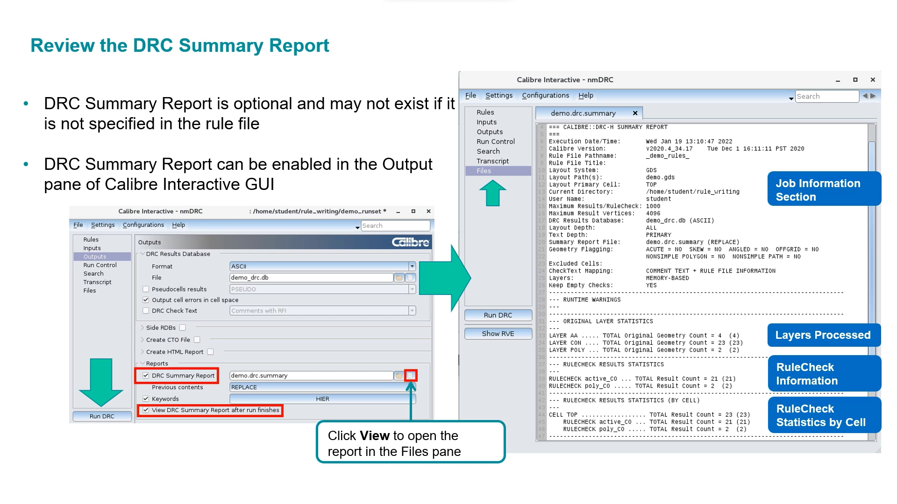

The **DRC Summary Report** is an optional text file that gives a clean, structured overview of the run. It is your best quick reference for "which rules failed and how many times?"

#### How to open it

- If **"View DRC Summary Report after run finishes"** was enabled in the Outputs pane, it opens automatically in the **Files pane**
- Otherwise, open it in any text editor or via the Files pane manually

#### Structure of the Summary Report

The report has four sections:

**1. Job Information Section**
```
=== CALIBRE::DRC-H SUMMARY REPORT
Execution Date/Time:      Wed Jan 19 13:10:47 2022
Calibre Version:          v2020.4_34.17
Rule File Pathname:        _demo_rules_
Layout System:             GDS
Layout Path(s):            demo.gds
Layout Primary Cell:       TOP
Maximum Results/RuleCheck: 1000
DRC Results Database:      demo_drc.db (ASCII)
Summary Report File:       demo.drc.summary (REPLACE)
```
Records exactly how the job was configured — essential for audit trails.

**2. Runtime Warnings**
Any warnings generated during the run (e.g., memory tuning suggestions).

**3. Layers Processed**
```
--- ORIGINAL LAYER STATISTICS
LAYER AA  ..... TOTAL Original Geometry Count = 4  (4)
LAYER CON ..... TOTAL Original Geometry Count = 23 (23)
LAYER POLY .... TOTAL Original Geometry Count = 2  (2)
```
Shows each input layer and the number of shapes found on it.

**4. RuleCheck Results Statistics (by Check and by Cell)**
```
--- RULECHECK RESULTS STATISTICS
RULECHECK active_CO ..... TOTAL Result Count = 21 (21)
RULECHECK poly_CO ....... TOTAL Result Count = 2  (2)

--- RULECHECK RESULTS STATISTICS (BY CELL)
CELL TOP ... TOTAL Result Count = 23 (23)
    RULECHECK active_CO ..... TOTAL Result Count = 23 (23)
    RULECHECK poly_CO ....... TOTAL Result Count = 2  (2)
```
The most important section — tells you exactly which rules failed and in which cells.

> 📌 **Note:** The DRC Summary Report only exists if you specified it in the Outputs pane or via the `DRC SUMMARY REPORT` SVRF command. It is not created by default.

---

### 4.3 Invoke RVE to View DRC Results


**RVE (Results Viewing Environment)** is Calibre's graphical error browser. It is far more powerful than reading text files because it connects directly to your layout viewer for cross-probing.

#### Two ways to open RVE

**From command line:**
```bash
# Find the results database name in your rule file
grep "DRC RESULTS" demo.rules
# Output: DRC RESULTS DATABASE demo_drc.db

# Launch RVE
calibre -rve demo_drc.db
```

**From Calibre Interactive GUI:**
In the **Run Control** pane, under **RVE Options**, enable:
- ✅ **Show Results in RVE**
- ✅ **Start RVE as soon as results are available** — RVE opens automatically when the run finishes

Other RVE launch options:

| Option | Use case |
|--------|---------|
| Start RVE after batch run | For jobs submitted to a compute cluster |
| Close RVE before running Calibre DRC | Prevents stale results from the previous run being visible |
| Close RVE when Calibre Interactive closes | Clean shutdown |

#### RVE Interface — Key Panels

| Panel | Location | What it shows |
|-------|----------|--------------|
| **Check / Cell Summary Tree** | Left | All rule checks and cells with violations |
| **Results List** | Top right | Numbered list of violations for the selected check |
| **Results Details** | Bottom right | Geometric coordinates of the selected violation |
| **Rule Check Comments** | Bottom bar | Author's explanatory notes about the check |

Example:
```
Filter: Show All    TOP, 23 Results (in 2 of 2 Checks)

Check / Cell         Results
✗ Check active_CO      21
✗ Check poly_CO         2
```

---

## Part 3 — Common DRC RVE Tasks


**Learning objectives for Part 3:**


- Modify RVE check/cell tree display
- Cross-probe results to layout viewer
- Modify result status

---

### Common DRC RVE Tasks — Overview


Common DRC tasks involving RVE include:
- Modify RVE check/cell tree display
- Cross-probe results to layout viewer
- Modify result status

---

### 5.1 Modify RVE Check/Cell Tree Display


By default RVE groups errors with rule checks at the top and cells underneath (**Check / Cell** view). You can change this to suit your workflow.

#### How to change the grouping

Go to **View → Tree Options → Group By** and choose:

| Option | Tree structure | Best used when... |
|--------|---------------|-------------------|
| **Check / Cell** *(default)* | Rule checks → cells | Fixing one rule at a time across all cells |
| **Cell / Check** | Cells → rule checks | Fixing all issues in one cell at a time |
| **Check** | Rule checks only | Quick count of violations per rule |
| **Cell** | Cells only | Quick count of violations per cell |

#### Cell / Check view example

```
Cell / Check              Results
✗ Cell lab2               4
   ✗ Check min_spacing_metal1   3
   ✗ Check min_spacing_metal2   1
✗ Cell a2311              3
✗ Cell a1230              1
```

You can immediately see `lab2` has the most errors.

#### Sorting

Click any **column heading** to sort by that column. An arrow in the heading indicates ascending or descending order. Sort by Results descending to tackle the worst checks first.

#### Other View options

- **Show Empty Checks** — show checks that ran but found zero violations (hidden by default)
- **Show Branch Prefix** — show the full hierarchical path for each cell name

---

### 5.2 Cross-Probe DRC Results to Layout Viewer


**Cross-probing** lets you click a violation in RVE and instantly see it highlighted in your layout viewer.

#### Step-by-step

1. **Select a rule check** from the Check / Cell tree that has errors (e.g., `Check active_CO`)
2. **Choose a highlighting option** by clicking the highlight icon in the RVE toolbar:

| Option | Effect |
|--------|--------|
| No View Change | Highlight but do not move the layout view |
| Pan to Highlights | Pan layout to show the error |
| **Zoom to Highlights** | Zoom in to the error *(recommended)* |
| Clear Existing Highlights | Remove all current highlights |

3. **Double-click an error number** in the Results List — the layout viewer immediately zooms to that location and highlights the violating geometry in red
4. **Read the Rule Check Comments** in the text pane at the bottom of RVE — the rule author explains what is being checked and often gives fix hints

> 💡 **Workflow tip:** After fixing an error in the layout editor, come back to RVE, right-click the error, and mark it **Fixed** to track your progress.

---

### 5.3 Displaying Errors in a Hierarchical Design


This is an important concept for hierarchical (non-flat) designs.

#### Default behavior — errors reported in top cell space

By default, Calibre reports errors using **top-cell-space coordinates** — specifically the left-most, lowest instance of the cell containing the error. The violation marker appears somewhere in the top-level view.

#### Alternative — errors reported in cell space

With **Output cell errors in cell space** enabled, Calibre uses the **local coordinate system of the cell** where the error lives.

**Benefit:** Double-clicking the error in RVE opens and zooms directly into the cell's own view, making the violation much easier to find and fix.

| Setting | Error location in RVE | Layout view behavior |
|---------|----------------------|---------------------|
| Cell space OFF (default off) | Top cell coordinates | Error shown in top-level view |
| Cell space ON ✅ | Local cell coordinates | RVE opens the cell, zooms to error inside it |

> 📌 **"Output cell errors in cell space" is checked by default in the Calibre Interactive GUI.** It is the recommended setting for hierarchical designs.

---

### 5.4 Report Errors in Cell Space


#### GUI setting — Outputs pane

- ✅ **Output cell errors in cell space** → errors in local cell coordinates *(default, recommended)*
- ☐ Unchecked → errors in top cell space coordinates

Uncheck this only if you specifically need all error coordinates in the global (top-level) reference frame.

The complete runset at this stage:

```svrf
// Job and User settings SVRF file
// Most basic setup file for DRC and LVS run
// Date: 12/1/2021
LAYOUT PRIMARY lab1     // TOPCELL
LAYOUT SYSTEM GDSII     // SPICE
LAYOUT PATH "/home/student/work/myLayout.gds"
DRC RESULTS DATABASE lab1.drc.results ASCII
DRC SUMMARY REPORT lab1.drc.summary

INCLUDE "drc.rules"
INCLUDE "golden_rules"
DRC MAXIMUM RESULTS 1000
```

---

### 5.5 What If the Error Is Still at the Top Level?

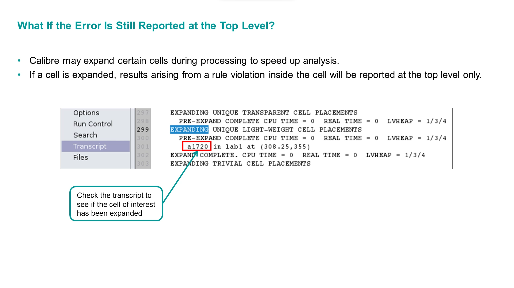

Even with cell-space reporting enabled, some errors still appear at the top level. This is expected and caused by **cell expansion**.

#### Why this happens — Cell Expansion

Calibre's hierarchical engine sometimes **flattens (expands) a cell** internally for processing efficiency. When a cell is expanded, its geometry is treated as part of the parent cell, so any violations are reported at the parent level.

Common reasons for expansion:
- Cell has only one instance (unique placement)
- Cell is very small (trivial)
- Cell is "light-weight" (no internal hierarchy)

#### How to check if your cell was expanded

Search the **Transcript pane** for `EXPANDING`:

```
297  EXPANDING UNIQUE TRANSPARENT CELL PLACEMENTS
299  EXPANDING UNIQUE LIGHT-WEIGHT CELL PLACEMENTS
301  a1720 in lab1 at (308.25, 355)    ← this cell was expanded
302  EXPAND COMPLETE. CPU TIME = 0  REAL TIME = 0
303  EXPANDING TRIVIAL CELL PLACEMENTS
```

If `a1720` was expanded, any errors inside it will be reported at the `lab1` top-level coordinates — not inside `a1720`. Check the transcript to confirm.

> ⚠️ Cell expansion is an internal optimization you cannot always prevent. Knowing about it helps you understand why an error appears "in the wrong place."

---

### 5.6 Set DRC Result Display Format

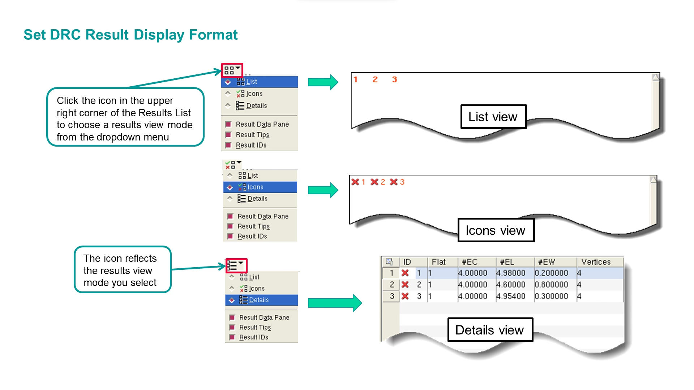

RVE offers three display modes for the Results List pane. Switch between them using the icon in the **upper right corner of the Results List**.

| Mode | Appearance | Best used when... |
|------|-----------|-------------------|
| **List** *(default)* | `1  2  3` — plain numbers | Many results, want a compact view |
| **Icons** | `✗1  ✗2  ✗3` — numbers with status icons | Visually tracking which results are fixed/waived |
| **Details** | Full table with coordinates and vertex counts | Need geometric measurements for each error |

#### Details view columns explained

| Column | Meaning |
|--------|---------|
| ID | Error number |
| Flat | Whether error is in flat (top-level) coordinates |
| #EC | X-coordinate of the error centroid |
| #EL | Y-coordinate of the error centroid |
| #EW | Width of the error marker |
| Vertices | Number of vertices in the error polygon |

> 💡 The toolbar icon automatically updates to reflect the currently selected mode.

---

### 5.7 Set DRC Result Status

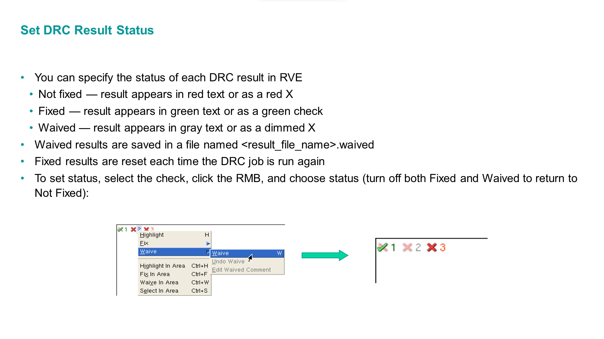

As you review violations, mark each one to track your progress. There are three statuses:

| Status | Visual indicator | Meaning |
|--------|-----------------|---------|
| **Not Fixed** | Red X / red text | Default — violation has not been addressed |
| **Fixed** | Green check / green text | Layout has been edited to fix this violation |
| **Waived** | Dimmed X / gray text | Violation is intentionally accepted and does not need fixing |

#### When to use "Waived"

Waived is for **intentional or pre-approved violations**. Examples:
- A foundry-approved exception for a seal ring structure
- Violations inside vendor IP that cannot be modified
- Known issues approved by the design manager

#### How to set status

1. Right-click on one or more results in the Results List
2. Choose **Fix**, **Waive → Waive**, or turn both off to return to **Not Fixed**

#### Important behaviors

- **Waived results persist** — saved in a `<result_file>.waived` file that survives between runs
- **Fixed results reset** — cleared each time you re-run DRC (correct behavior: you must re-run to confirm the fix worked)

---

### 5.8 Comment and View Waived Results

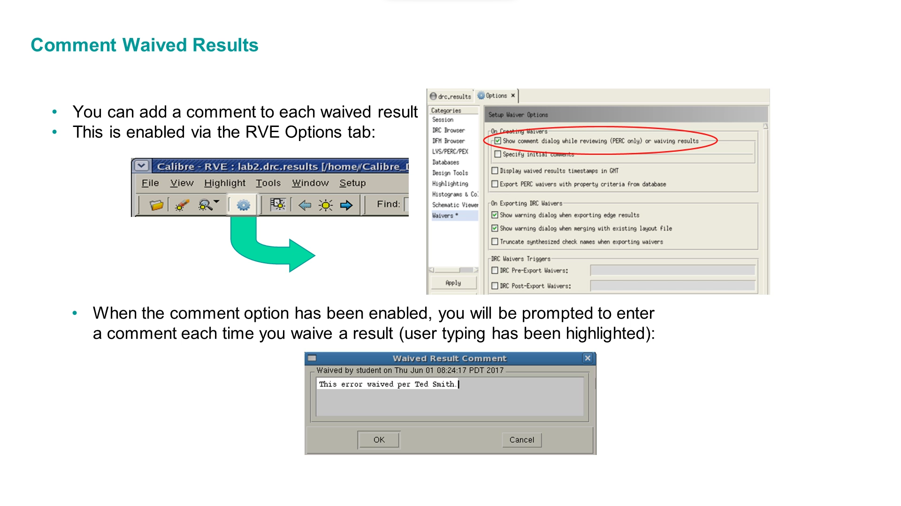

Best practice is to add a comment to every waived result explaining **why** it was waived. This is essential for design reviews and tapeout audits.

#### How to enable waiver comments

1. In RVE, click the **Setup (gear icon)** in the toolbar → opens RVE Options
2. Go to the **Waivers** category
3. Check **"Show comment dialog while reviewing (PERC only) or waiving results"**
4. Click **Apply**

Now when you waive a result, a dialog appears:

```
┌──────────────────────────────────────────────────────┐
│  Waived Result Comment                               │
│  Waived by student on Thu Jun 01 08:24:17 PDT 2017   │
│  ┌────────────────────────────────────────────────┐  │
│  │ This error waived per Ted Smith.               │  │
│  └────────────────────────────────────────────────┘  │
│                               [OK]      [Cancel]     │
└──────────────────────────────────────────────────────┘
```

Timestamp and username are added automatically. You type your justification and click OK.

#### Viewing waiver comments — three methods

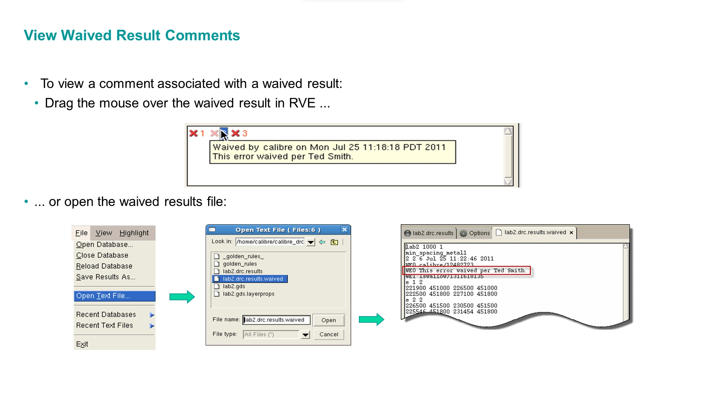

**Method 1 — Hover tooltip**
In the Results List, hover over a waived result (dimmed X). A tooltip shows:
```
Waived by calibre on Mon Jul 25 11:18:18 PDT 2011
This error waived per Ted Smith.
```

**Method 2 — Open the `.waived` file in RVE**
Go to **File → Open Text File...** and open `<results_name>.waived`. The file shows all waived errors with their coordinates and comments.

**Method 3 — Create an ASCII Waiver Report**

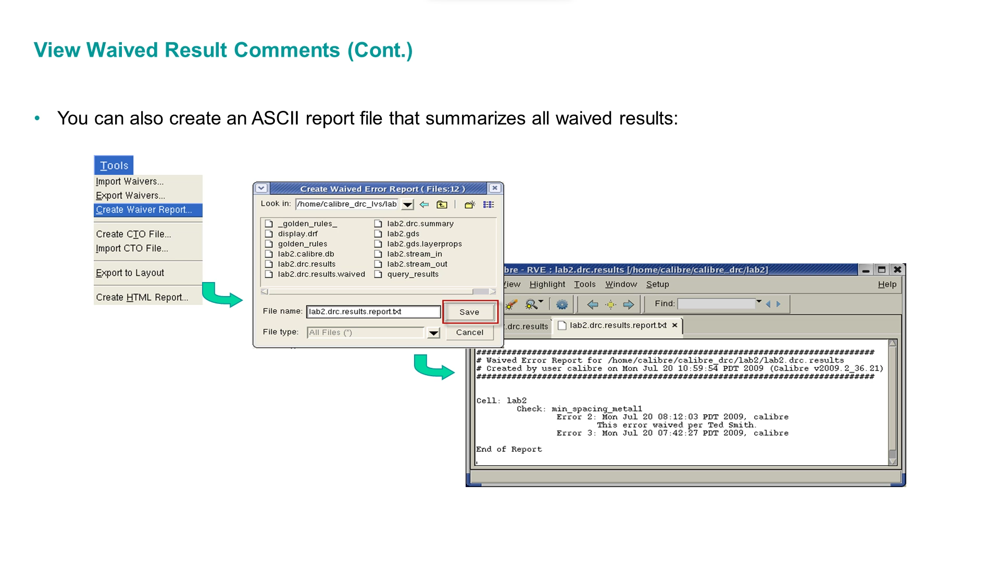

For formal design reviews, generate a clean summary:
1. In RVE, go to **Tools → Create Waiver Report...**
2. Choose a file name (e.g., `lab2.drc.results.report.txt`) and click **Save**

The report format:
```
##############################################################
# Waived Error Report for .../lab2/lab2.drc.results
# Created by user calibre on Mon Jul 20 10:59:54 PDT 2009
##############################################################

Cell: lab2
    Check: min_spacing_metal1
        Error 2:  Mon Jul 20 08:12:03 PDT 2009, calibre
                  This error waived per Ted Smith.
        Error 3:  Mon Jul 20 07:42:27 PDT 2009, calibre

End of Report
```

> 💡 Attach this report to your tapeout checklist or design review package so every waiver has a documented justification.

---

## 6. Chapter Summary

| Concept | Key Takeaway |
|---------|-------------|
| nmDRC process flow | Layout + Rule File → Calibre nmDRC → Results DB → RVE → Fix → repeat |
| Two run methods | GUI (interactive) and SVRF runset file (command line/automation) |
| `INCLUDE` | SVRF command that loads a rule file into the job |
| `LAYOUT PRIMARY` | Sets the top cell name |
| `LAYOUT SYSTEM` | Sets the layout file format (e.g., GDSII) |
| `LAYOUT PATH` | Sets the layout file path |
| `DRC RESULTS DATABASE` | Sets the output results file name and format |
| `DRC SUMMARY REPORT` | Sets the optional text summary file name |
| `DRC MAXIMUM RESULTS` | Limits violations stored per rule check |
| Transcript | Real-time run log — check for EXPANDING, warnings, result counts |
| DRC Summary Report | Structured post-run summary — best place to see which rules failed |
| RVE | Graphical error browser with layout cross-probing |
| Cell space errors | Errors reported inside the cell's own coordinate system (default, recommended) |
| Cell expansion | Calibre may flatten cells internally — errors then appear at parent level |
| Result status | Not Fixed (red) / Fixed (green) / Waived (gray) |
| Waiver file | `.waived` file persists waivers between runs |

---

## 7. Quick Reference — Job Settings SVRF File

```svrf
// ============================================================
// Job and User settings SVRF file
// Most basic setup file for DRC and LVS run
// Date: 12/1/2021
// ============================================================

// --- INPUT SETTINGS ---
LAYOUT PRIMARY lab1          // Top cell name in the layout
LAYOUT SYSTEM GDSII          // Layout file format
LAYOUT PATH "/home/student/work/lab1.gds"  // Path to the layout file

// --- OUTPUT SETTINGS ---
DRC RESULTS DATABASE lab1.drc.results ASCII  // Violation data output
DRC SUMMARY REPORT lab1.drc.summary          // Text summary output

// --- OPTIONS ---
DRC MAXIMUM RESULTS 1000     // Max violations stored per rule check

// --- RULE FILES ---
INCLUDE "drc.rules"          // Main foundry rule file
INCLUDE "golden_rules"       // Additional rule file
```

> 💡 **Save this as a template.** Every DRC job shares this same basic structure. Change only the layout path, top cell name, and output file names for each new project.

---

*End of Chapter 02 — Calibre nmDRC Basics*

*Next: [Chapter 03 — Calibre nmDRC Job Customization](../chapter-03/)*
