# Chapter 03 — nmDRC Job Customization & Advanced Features
### Using Calibre nmDRC/nmLVS

> This chapter covers how to customize, control, and optimize your Calibre nmDRC jobs using SVRF statements and the Calibre Interactive GUI. Topics include grouping rule checks, conditional execution, layout halos, performance enhancement, and DRC debugging with RVE.

---

## Table of Contents

1. [nmDRC Job Customization Overview](#1-nmdrc-job-customization-overview)
2. [Grouping Rule Checks](#2-grouping-rule-checks)
3. [Enabling & Disabling Selected Rule Checks](#3-enabling--disabling-selected-rule-checks)
4. [Conditional SVRF Execution](#4-conditional-svrf-execution)
5. [Limiting Result Count](#5-limiting-result-count)
6. [Layout Halos — Checking Selected Areas](#6-layout-halos--checking-selected-areas)
7. [Layout Window Clipping & Exclusion](#7-layout-window-clipping--exclusion)
8. [Excluding Specified Cells](#8-excluding-specified-cells)
9. [Performance Enhancing Options](#9-performance-enhancing-options)
10. [DRC Debugging Enhancement Using RVE](#10-drc-debugging-enhancement-using-rve)

---

## 1. nmDRC Job Customization Overview

SVRF (Standard Verification Rule Format) provides a wide variety of job customization options that allow you to control exactly how your DRC job runs. This chapter covers the most commonly used basic options:

| Feature | What It Does |
|---|---|
| **Grouping rule checks** | Combine related checks under a single group name |
| **Enable/Disable checks** | Run only the checks you need at any given time |
| **Limit result counts** | Cap the number of results per check |
| **Check selected areas** | Run DRC on only part of your layout |
| **Exclude cells** | Skip specific cells during verification |

Both **GUI-based** and **text-based (SVRF)** approaches are presented for each feature.

### Example SVRF Job Customization File

```svrf
// Job customization SVRF file

GROUP m1_rules min_m1_width min_spacing_m1 m1_enclose_cont
DRC SELECT CHECK min_metal2_width min_spacing_metal2
DRC UNSELECT CHECK min_poly_width poly_enclose_cont
DRC MAXIMUM RESULTS 1000
LAYOUT WINDOW 271.7 91.7 372.8 -8.6
EXCLUDE CELL blrplate "test*"
```

---

## 2. Grouping Rule Checks

Rule checks can be combined into named **groups** for easy selection and management. Groups are defined using the `GROUP` SVRF statement.

### Syntax

```svrf
GROUP group_name rule_check [rule_check ...]
```

### Example

```svrf
// Job customization SVRF file

GROUP m1_rules min_m1_width min_spacing_m1 m1_enclose_cont
```

This creates a group called `m1_rules` containing three individual checks. You can then select or deselect the entire group at once.

### How to Define Groups in the GUI

You can also define groups directly in the Calibre Interactive GUI without editing the rule file:

1. Open the **Options** window in the left panel
2. Enable the **Include Rule Statements** checkbox
3. Enter your `GROUP` SVRF statement in the **Include SVRF Rule Statements** text box

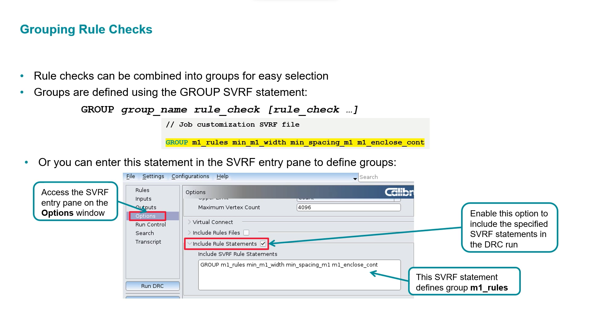

> **Tip:** Enabling the "Include Rule Statements" option includes the specified SVRF statements in the DRC run without modifying your main rule file.

---

## 3. Enabling & Disabling Selected Rule Checks

Once groups are defined, you can selectively **enable** or **disable** individual checks using the Recipe Editor in the Calibre GUI, or using SVRF statements.

### SVRF Syntax

```svrf
// Enable specific checks
DRC SELECT CHECK min_metal2_width min_spacing_metal2

// Disable specific checks
DRC UNSELECT CHECK min_poly_width poly_enclose_cont
```

---

### 3a. Enabling Selected Rule Checks

To run only specific checks using the GUI:

1. Open the **Rules** pane
2. Click **Edit** next to the Recipe field to open the **Check Selection Recipe Editor**
3. Click **None** to unselect all checks
4. Select only the checks you want included in the run
5. Click **Apply**

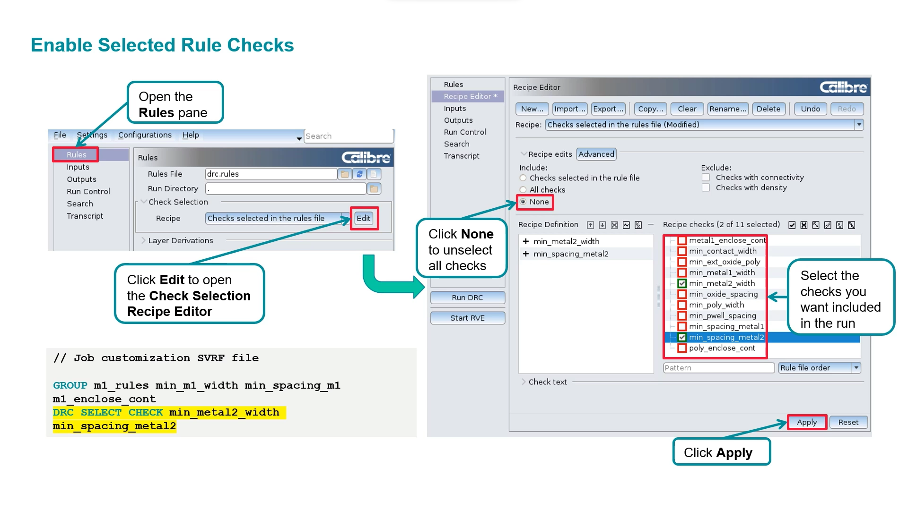

---

### 3b. Disabling Selected Rule Checks

To exclude specific checks from a run:

1. Open the **Rules** pane
2. Click **Edit** to open the **Check Selection Recipe Editor**
3. Start with **All checks** selected
4. Uncheck the checks you do **not** want in the run
5. Click **Apply**

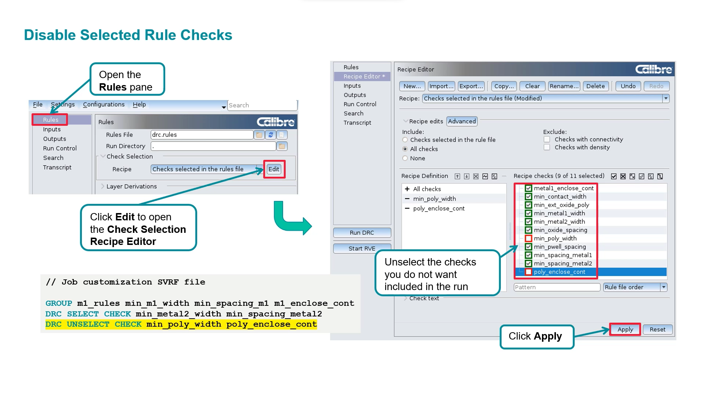

---

## 4. Conditional SVRF Execution

Conditional execution allows you to selectively run or skip SVRF statements based on variables — useful for **debugging** without permanently modifying your rule file.

### Key Points

- All statements in SVRF files are normally considered for execution
- You can temporarily disable selected statements during debugging (e.g., run only checks for a specific layer)
- Conditional execution is controlled by variables defined either in the **rule file** or in the **Unix environment**
- **Do not use conditional rules for final tape-out**

### How It Works

You can use `#IFDEF` / `#ELSE` / `#ENDIF` preprocessor statements in your rule file:

```svrf
#IFDEF $LAYER "m1"
    DRC SELECT CHECK m1_rules
#ELSE
    #IFDEF $LAYER "m2"
        DRC SELECT CHECK m2_rules
    #ENDIF
#ENDIF
```

You can define the variable in three ways:

**1. Command line (Unix environment):**
```bash
[student ~]$ setenv LAYER m1
```

**2. SVRF rule file:**
```svrf
// Job customization SVRF file
VARIABLE LAYER m1
```

**3. Calibre Interactive GUI:**
Navigate to **Settings > Show Pages > Environment** to enable, disable, or change variables directly in the GUI.

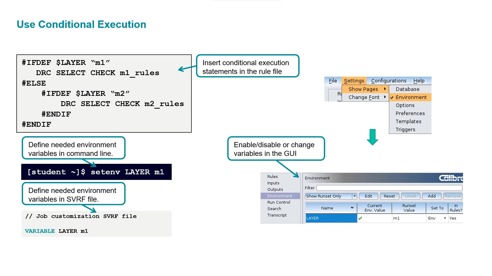

---

## 5. Limiting Result Count

When a rule check generates more output results than a specified maximum, execution passes to the next rule check. This helps keep runs manageable during debugging.

### Key Points

- The **default result limit is 1000** per check
- Use `ALL` when the output data format is GDS or OASIS (no limit)
- Configure via GUI or SVRF statement

### SVRF Syntax

```svrf
DRC MAXIMUM RESULTS 1000
```

### GUI Configuration

In the Calibre Interactive GUI:
1. Go to the **Options** pane
2. Enable **DRC Maximum Results**
3. Set the **Upper Limit** type and the **Maximum Result Count**

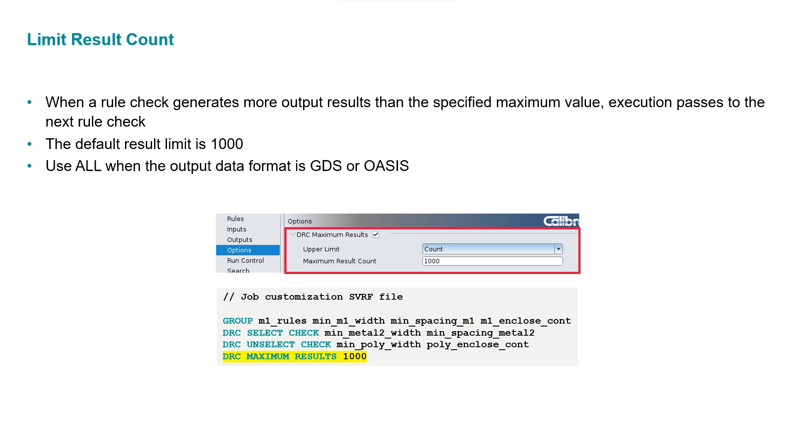

---

## 6. Layout Halos — Checking Selected Areas

Instead of running DRC on the entire layout, you can restrict verification to a **selected area** (a layout window). This is especially useful for focused debugging.

### 6a. Check Selected Area via GUI

1. Open the **Inputs** pane
2. Enable the **Area DRC** option
3. Either type the opposing-corner window coordinates manually, or click the button and drag a rectangle in the layout viewer
4. The GUI automatically adds a **halo** around your window

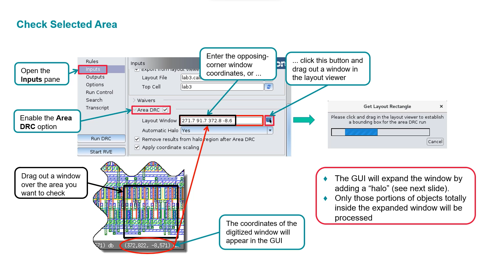

> **Note:** The GUI expands your selected window by a "halo" to avoid false edge errors. Only portions of objects totally inside the expanded window are processed.

---

### 6b. Layout Window Halos Explained

When you use the Area DRC option, Calibre Interactive expands the layout window by a **halo**. The halo size can be set automatically or manually.

- **Automatic Halo (Yes):** Set to the larger of the window width and height
- **Manual Halo:** Specify a custom halo size
- **Halo Size = 0:** Equivalent to using `LAYOUT WINDOW CLIP YES`

The diagram below shows the impact of different halo settings on which results are included:

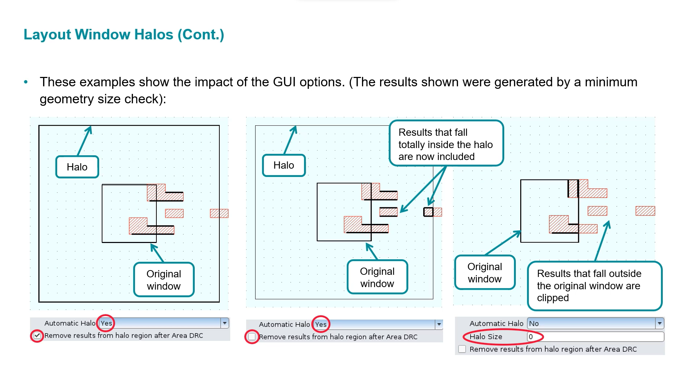

| Setting | Effect |
|---|---|
| Auto Halo = Yes, Remove results from halo = ✓ | Results inside original window only |
| Auto Halo = Yes, Remove results from halo = ✗ | Results in halo are also included |
| Halo Size = 0 | Results outside original window are clipped |

---

### 6c. Check Selected Area in the Rule File

You can also specify the layout window directly in the SVRF rule file.

### Syntax

```svrf
LAYOUT WINDOW x1 y1 x2 y2 [xN yN ...]
```

### Example

```svrf
LAYOUT WINDOW 271.7 91.7 372.8 -8.6
```

### Key Points

- Only objects **totally inside or intersecting** the window will be processed
- Coordinate pairs specify window vertex locations
- Two coordinate pairs = lower-left and upper-right corners
- Multiple windows can be specified

---

## 7. Layout Window Clipping & Exclusion

### 7a. Layout Window Clipping

Window clipping controls whether objects that extend **outside** the layout window are discarded.

### Syntax

```svrf
LAYOUT WINDOW CLIP {NO | YES}
```

### Example

```svrf
LAYOUT WINDOW 271.7 91.7 372.8 -8.6
LAYOUT WINDOW CLIP YES
```

- **YES:** Portions of layout objects lying outside the window are discarded (equivalent to halo size of 0 in the GUI)
- **NO (default):** Objects intersecting the window boundary are still included

---

### 7b. Exclude a Specified Area

To exclude a specific region from DRC processing (the inverse of `LAYOUT WINDOW`):

### Syntax

```svrf
LAYOUT WINDEL x1 y1 x2 y2 [xN yN ...]
```

### Example

```svrf
LAYOUT WINDEL 271.7 91.7 372.8 -8.6
```

- Only objects **totally outside or intersecting** the excluded window will be processed
- Multiple exclusion windows can be specified

---

## 8. Excluding Specified Cells

You can instruct Calibre nmDRC to completely ignore one or more cells during verification using the `EXCLUDE CELL` statement.

### Syntax

```svrf
EXCLUDE CELL cell_name [cell_name ...]
```

### Example

```svrf
EXCLUDE CELL blrplate "test*"
```

### Key Points

- No objects from any placement of the excluded cells are processed
- The wildcard `*` matches zero or more characters
- If `*` appears as part of a cell name, the entire name must be enclosed in quotes

### Full SVRF Example with All Customizations

```svrf
// Job customization SVRF file

GROUP m1_rules min_m1_width min_spacing_m1 m1_enclose_cont
DRC SELECT CHECK min_metal2_width min_spacing_metal2
DRC UNSELECT CHECK min_poly_width poly_enclose_cont
DRC MAXIMUM RESULTS 1000
LAYOUT WINDOW 271.7 91.7 372.8 -8.6
LAYOUT WINDOW CLIP YES
EXCLUDE CELL blrplate "test*"
```

---

## 9. Performance Enhancing Options

Calibre offers several options to speed up large DRC jobs. The right option depends on your job size, license availability, and computing environment.

### Available Performance Options

| Option | Description |
|---|---|
| **Calibre MT** | Distribute a design across multiple CPUs on the **same host** |
| **Calibre MTFlex™** | Distribute a design across multiple CPUs on **networked hosts** |
| **Hyperscaling** | Enhance Calibre MT/MTFlex jobs by executing operations in parallel across multiple CPUs |

> **Note:** The number of licenses required depends on the number of CPUs used. A properly-defined SVRF `LAYOUT BASE LAYER` statement is required when using hyperscaling.

---

### 9a. Using Calibre MT (Multiple Threads)

To enable multi-threading on a single host:

1. Open the **Run Control** pane
2. Choose the **Run Calibre** section
3. Set **Run Calibre DRC using** → `Multiple Threads`
4. Select the **Number of CPUs** to use
5. Optionally enable **Hyperscale**

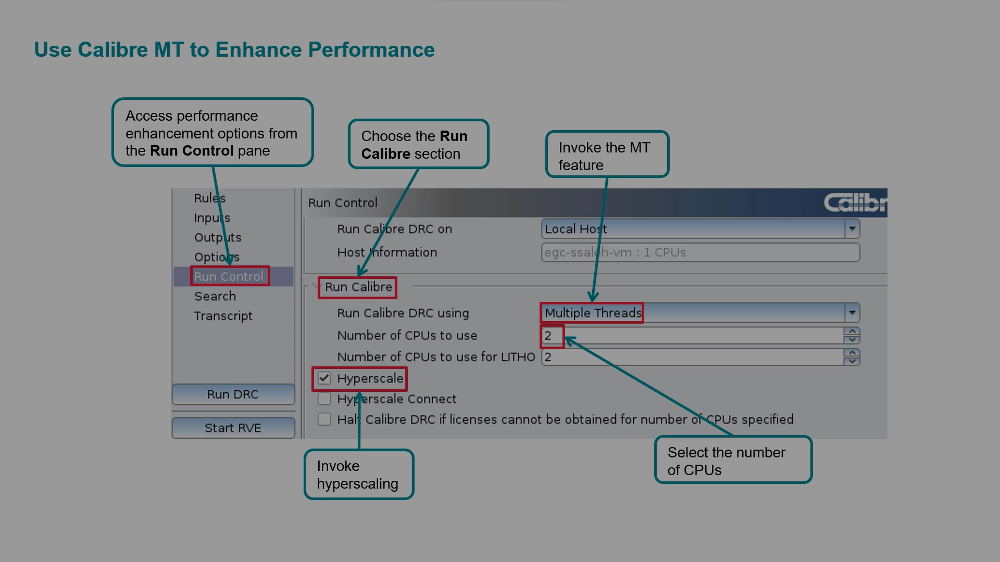

---

### 9b. Using Calibre MTFlex (Distributed)

To distribute across networked hosts:

1. Open the **Run Control** pane
2. Set **Run Calibre DRC using** → `Distributed (MTFlex)`
3. Enable **Hyperscale** if desired
4. Under **Remote Hosts**, choose **Specify from GUI**
5. Click **Add Host (+)** to manually enter remote host names
6. All hosts must be of the same type

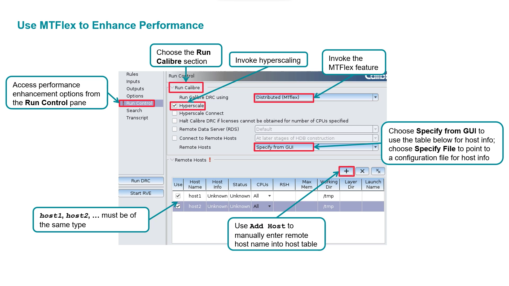

---

### 9c. Simplified DRC View

If you only need to change a basic set of options, you can use the **Simplified DRC View**. This combines the essential settings from the Rules, Inputs, and Outputs pages onto a single page.

To activate: **Configurations > Simple DRC**

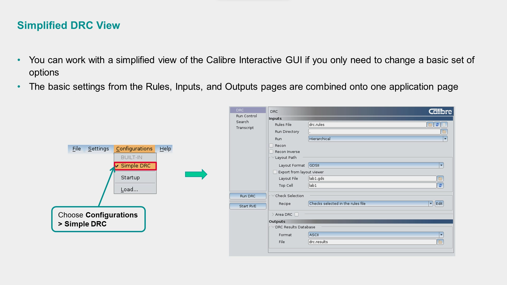

---

## 10. DRC Debugging Enhancement Using RVE

The **Results Viewing Environment (RVE)** provides powerful tools to help you debug DRC results efficiently. Calibre RVE offers a wide variety of options including:

- Displaying results in priority order
- Controlling the layout window view
- Customizing result highlighting
- Clearing highlights on exit

---

### 10a. Display Results in Priority Order

You can assign a priority to each rule check using an `RVE PRIORITY` comment in your rule file:

```svrf
min_spacing_metal1 {
    @ RVE PRIORITY: 2
    @ Min metal1 spacing = 1.0
    EXT metal1 < 1.0
}
```

Then in RVE:
1. Click the column menu icon to open column settings
2. Enable the **Priority** column
3. Click the **Priority** column heading to sort results by priority

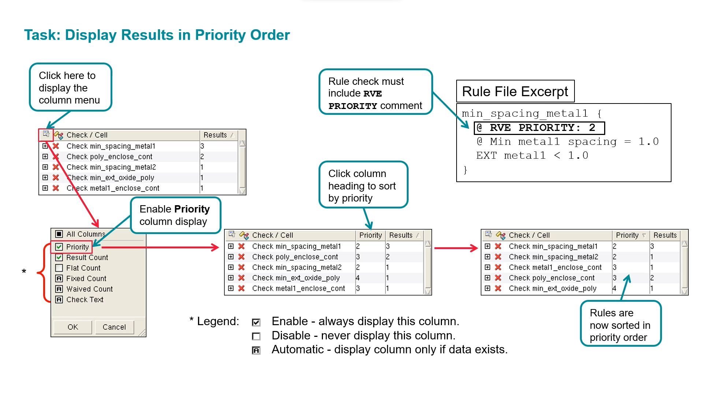

---

### 10b. Control the Layout Window

Use the RVE taskbar menu to specify the window behavior for each new highlight:

- **No View Change** — layout view stays as-is
- **Pan to Highlights** — layout pans to show highlighted results
- **Zoom to Highlights** — layout zooms in on highlighted results

Use the RVE **Options** tab to set the zoom factor ratio.

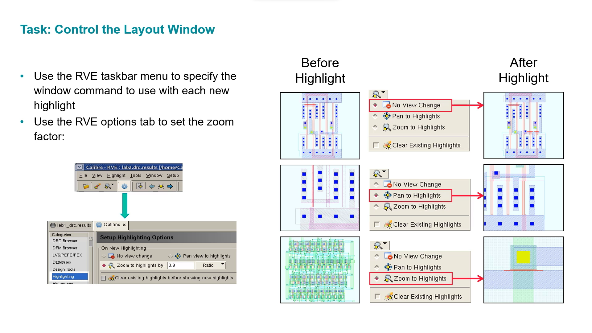

---

### 10c. Customize Result Highlighting

Use the RVE taskbar menu to enable or disable **Clear Existing Highlights** when displaying new highlights:

- **Option disabled:** New highlights are added on top of existing ones (both visible simultaneously)
- **Option enabled:** Previous highlights are cleared before showing new ones

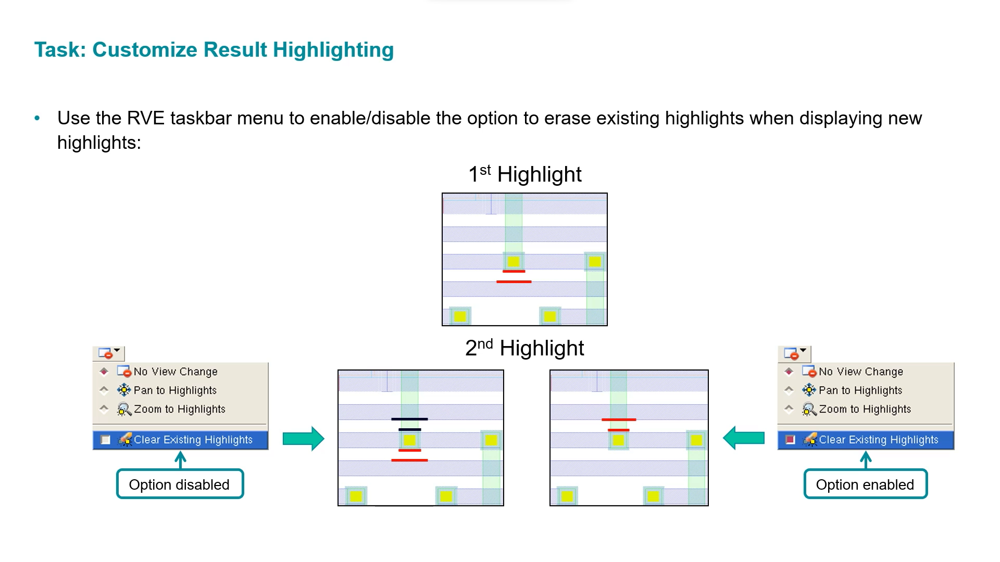

You can also open the RVE **Options** tab (gear icon) and configure detailed highlighting behavior, including showing check names, result IDs, and properties when highlighting.

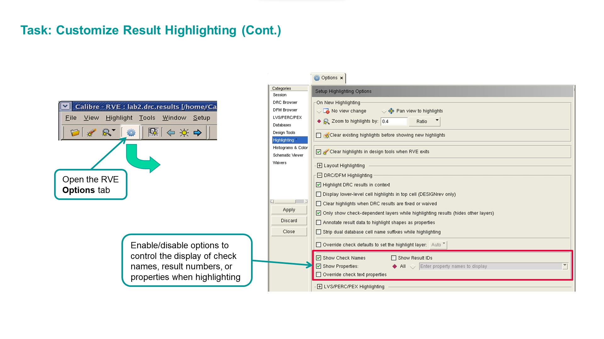

---

### 10d. Define Layer Highlighting for Rule Checks

Rule check comment statements in your SVRF file control how RVE highlighting appears in the layout viewer.

| Comment | Purpose |
|---|---|
| `@ RVE Show Layers` | Specifies which layers to display when highlighting results from this check |
| `@ RVE Highlight Color` | Defines the color of the highlight layer |
| `@ RVE Highlight Index` | Defines the highlight layer number |

### Example

```svrf
min_ext_diff_poly {
    @ minimum enclosure of poly by diff
    @ RVE Show Layers: poly diff
    @ RVE Highlight Color: blue
    enc diff poly < 1.25
}
```

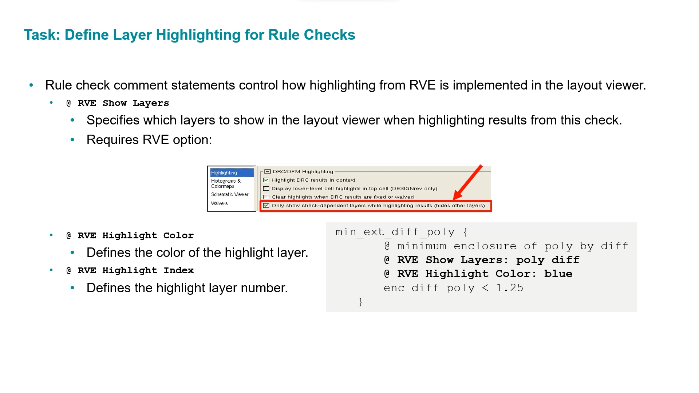

---

### 10e. Override Rule Check Color Choices

You can override the colors defined in the rule file using the RVE GUI:

**Navigate to:** `Highlight > Set Check Highlight Layers`

**To let RVE choose colors automatically:**
1. Select **Override Check Defaults**
2. Select **Auto**
3. Click **OK**

**To specify custom colors:**
1. Select **Override Check Defaults**
2. Select **Colors**
3. Click on a rule check color box
4. Choose your color
5. Repeat as needed, then click **OK**

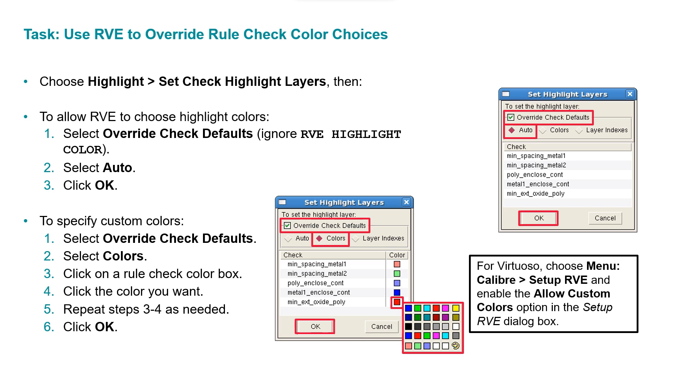

---

### 10f. Clear Highlights on RVE Exit

RVE creates layout highlights by adding geometry on reserved RVE layers. By default, these are **deleted from the layout when you exit RVE**.

To **retain** highlight geometries after exiting RVE:
1. Open the RVE **Options** tab (gear icon)
2. Go to the **Highlighting** category
3. **Uncheck** the option: *Clear highlights in design tools when RVE exits*

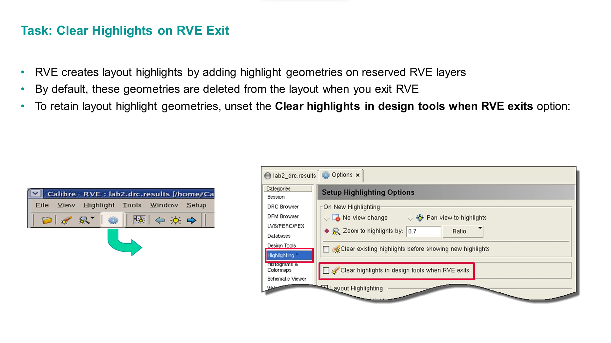

---

## Summary

| Topic | Key SVRF Statement | GUI Location |
|---|---|---|
| Group checks | `GROUP name check1 check2` | Options > Include Rule Statements |
| Enable checks | `DRC SELECT CHECK check1` | Rules > Recipe Editor |
| Disable checks | `DRC UNSELECT CHECK check1` | Rules > Recipe Editor |
| Conditional execution | `#IFDEF / #ELSE / #ENDIF` | Settings > Environment |
| Limit results | `DRC MAXIMUM RESULTS 1000` | Options > DRC Maximum Results |
| Check window | `LAYOUT WINDOW x1 y1 x2 y2` | Inputs > Area DRC |
| Clip window | `LAYOUT WINDOW CLIP YES` | Inputs > Area DRC > Halo Size 0 |
| Exclude area | `LAYOUT WINDEL x1 y1 x2 y2` | N/A |
| Exclude cell | `EXCLUDE CELL cell_name` | N/A |
| Multi-threading | N/A | Run Control > Multiple Threads |
| MTFlex | N/A | Run Control > Distributed (MTFlex) |

---

## Repository Structure

```
notes/
└── chapter-03/          ← Your notes for this chapter

resources/screenshots/
└── chapter-03/          ← All diagram and content images

slides/                  ← Slide decks

README.md                ← This file
```

---

*Course: Using Calibre nmDRC/nmLVS — Siemens EDA*
