# Chapter 4: Calibre nmDRC Additional Topics

> **Course:** Using Calibre nmDRC/nmLVS — Siemens EDA
> **Chapter:** 04 — nmDRC Additional Topics
> **Path:** `notes/chapter-04/README.md`

---

## Table of Contents

1. [Chapter Overview](#chapter-overview)
2. [Module 1 — Create DRC HTML Report & Customize Rule Selection Recipe](#module-1--create-drc-html-report--customize-rule-selection-recipe)
   - [Creating a DRC HTML Report](#creating-a-drc-html-report)
   - [Selecting Rule Checks by Layer](#selecting-rule-checks-by-layer)
   - [Task: Select Rule Checks by Layer](#task-select-rule-checks-by-layer)
   - [Task: Unselect Rule Checks by Layer](#task-unselect-rule-checks-by-layer)
3. [Module 2 — Fix and Waive RVE Results](#module-2--fix-and-waive-rve-results)
   - [Working With Fixed and Waived Results in RVE](#working-with-fixed-and-waived-results-in-rve)
   - [Task: Fix/Waive Results by Area](#task-fixwaive-results-by-area)
   - [Task: Clear Fixed/Waived Highlights](#task-clear-fixedwaived-highlights)
   - [Importing Waived Results Files](#importing-waived-results-files)
   - [Preserving Cells With Error Waivers](#preserving-cells-with-error-waivers)
4. [Module 3 — Additional RVE Features](#module-3--additional-rve-features)
   - [Viewing Dynamic Results in RVE](#viewing-dynamic-results-in-rve)
   - [RVE Result Tables](#rve-result-tables)
   - [Displaying Added Properties](#displaying-added-properties)
   - [Creating RVE Histograms](#creating-rve-histograms)
   - [Configuring Property Display in DESIGNrev](#configuring-property-display-in-designrev)
   - [Displaying Property Values in Cadence Virtuoso](#displaying-property-values-in-cadence-virtuoso)
5. [Module 4 — Layout-versus-Layout (LVL) Options](#module-4--layout-versus-layout-lvl-options)
   - [Layout-Versus-Layout Overview](#layout-versus-layout-overview)
   - [Using the Layout Diff Tool in DESIGNrev](#using-the-layout-diff-tool-in-designrev)
   - [Using DBdiff to Compare Designs](#using-dbdiff-to-compare-designs)
   - [DBdiff Example](#dbdiff-example)
   - [Using Fast XOR to Compare Designs](#using-fast-xor-to-compare-designs)
6. [Quick Reference Summary Table](#quick-reference-summary-table)

---

## Chapter Overview

Chapter 4 extends your knowledge of Calibre nmDRC by covering four advanced operational topics that are essential for professional physical verification workflows:

- **DRC HTML Reporting** — Generating structured, browser-viewable reports from DRC runs with automatic highlight images and configurable output formats.
- **Fix and Waive RVE Results** — Managing DRC errors by marking them as fixed or waived, persisting waivers across runs, importing waiver files, and preserving cells during hierarchical DRC.
- **Additional RVE Features** — Leveraging powerful analysis capabilities such as dynamic result viewing, result tables, added property display, and histograms.
- **Layout-versus-Layout (LVL) Comparison** — Comparing two versions of a design to detect geometric differences using the Layout Diff tool in DESIGNrev, the standalone DBdiff utility, or Fast XOR in Calibre Interactive.

These capabilities allow engineers to efficiently triage, document, and resolve design rule violations at scale across complex hierarchical designs.

---

## Module 1 — Create DRC HTML Report & Customize Rule Selection Recipe

### Objectives

- Creating a DRC HTML report directly from Calibre Interactive nmDRC.
- Specifying rule check selection based on layers referenced.

---

### Creating a DRC HTML Report

Calibre Interactive nmDRC can automatically generate a DRC HTML Report immediately after the Calibre run completes. This report provides a browser-viewable summary of all DRC results, organized into three distinct sections for easy navigation and analysis.

**Key capabilities:**

- You can use a **pre-defined configuration file** or supply your **own custom configuration file** to control the report's format and presentation style.
- **Highlight images are automatically included** within the report — no manual capture is required. A shell script is also generated so that you can regenerate the report independently from the command line at a later time.
- DRC HTML report creation is only supported when the input layout format is **GDS** or **OASIS**. Other formats such as LEF/DEF or OpenAccess are not eligible.

**How to enable HTML Report generation:**

Navigate to the **Outputs** pane in Calibre Interactive nmDRC and follow these steps:

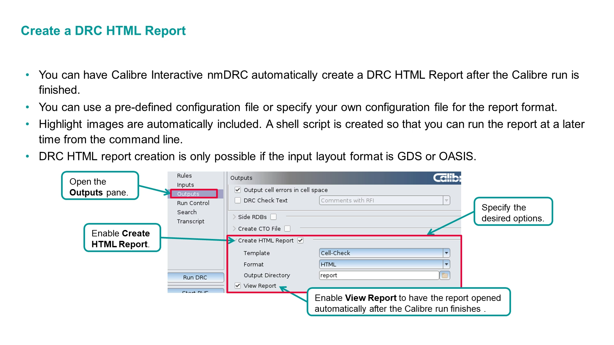

| Step | Action |
|------|--------|
| 1 | Open the **Outputs** pane from the left navigation panel |
| 2 | Enable the **Create HTML Report** checkbox |
| 3 | Choose a **Template** (e.g., `Cell-Check`) from the dropdown |
| 4 | Set the **Format** to `HTML` |
| 5 | Specify an **Output Directory** (e.g., `report`) |
| 6 | Optionally enable **View Report** to auto-open the report once the run finishes |

**DRC HTML Report Structure:**

The generated HTML report is divided into three main sections:

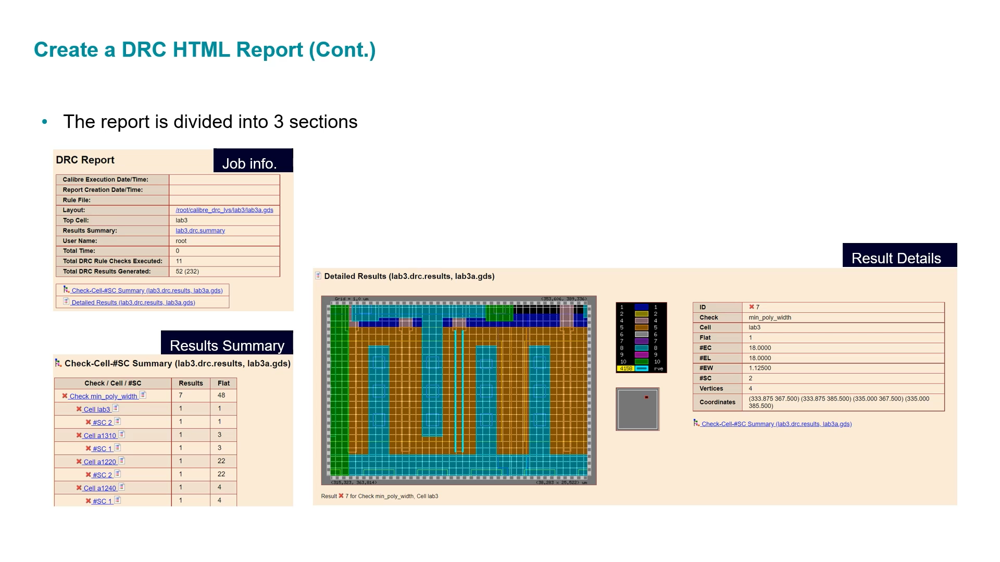

| Section | Description |
|---------|-------------|
| **Job Info** | Displays run metadata: Calibre execution date/time, rule file path, layout name, top cell, user name, total time, and total DRC rule checks executed and results generated |
| **Results Summary** | A tabular breakdown of each check by cell, subcell (SC), result count, and flat result count — with hyperlinks for drill-down navigation |
| **Result Details** | A visual layout view with highlighted error markers, alongside a detailed result properties panel showing check name, cell, coordinates, vertices, and SC/EL/EW counts |

---

### Selecting Rule Checks by Layer

In large physical verification workflows, it is often desirable to **run only the subset of DRC checks that are relevant to a specific layer**, rather than executing the entire rule deck. Calibre provides this capability natively through the GUI's Rule Check Selection feature.

**Two filtering modes are available:**

- **Checks with selected layer only** — Selects rules that exclusively reference the specified layer (e.g., `min_metal1_width`, which involves only Metal1).
- **Checks including selected layer** — Selects rules that reference the specified layer along with zero or more additional layers (e.g., `metal1_enclose_contact`, which involves both Metal1 and Contact).

This distinction is important: the first mode gives you a narrow, focused subset; the second gives you a broader set of inter-layer checks that still involve your target layer.

---

### Task: Select Rule Checks by Layer

The following walkthrough demonstrates how to configure the Check Selection Recipe Editor to include only checks that involve a specific layer (in this example, `metal2`).

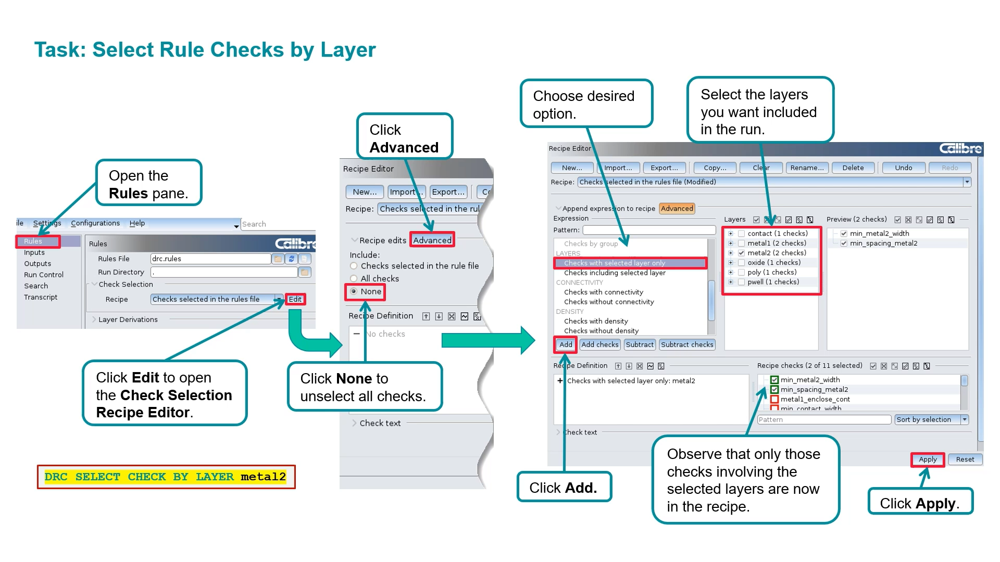

**Procedure:**

1. Open the **Rules** pane in Calibre Interactive.
2. Under **Check Selection**, click **Edit** to open the **Check Selection Recipe Editor**.
3. In the Recipe Editor, click **None** to unselect all checks — this resets the recipe to an empty starting point.
4. Click **Advanced** to expand the advanced filtering options.
5. Under the **Layers** panel, select the target layer (e.g., `metal2`).
6. Under the **LAYERS** section of the Expression panel, choose **Checks with selected layer only**.
7. Click **Add** to populate the Recipe Definition with all checks that exclusively involve `metal2`.
8. Verify in the **Recipe checks** preview that only the expected checks (e.g., `min_metal2_width`, `min_spacing_metal2`) appear.
9. Click **Apply** to commit the recipe.

**Equivalent SVRF statement:**

```svrf
DRC SELECT CHECK BY LAYER metal2
```

---

### Task: Unselect Rule Checks by Layer

This task demonstrates the inverse operation — starting from a full set of checks and **subtracting** those that involve a specific layer (in this example, `metal1`).

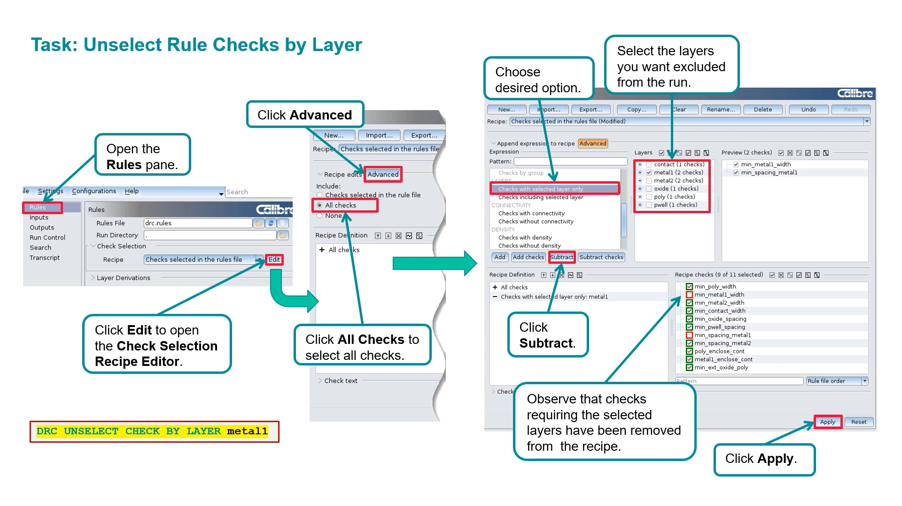

**Procedure:**

1. Open the **Rules** pane and click **Edit** to launch the **Check Selection Recipe Editor**.
2. Click **All Checks** under the Include section to begin with all checks selected.
3. Click **Advanced** to access layer-based filtering.
4. Under the **Layers** panel, select the layer to be excluded (e.g., `metal1`).
5. Under the LAYERS section, choose **Checks with selected layer only**.
6. Click **Subtract** to remove all checks exclusively involving `metal1` from the recipe.
7. Observe in the **Recipe Definition** panel that checks requiring `metal1` (such as `min_metal1_width`, `min_spacing_metal1`) have been removed, while unrelated checks remain.
8. Click **Apply**.

**Equivalent SVRF statement:**

```svrf
DRC UNSELECT CHECK BY LAYER metal1
```

---

## Module 2 — Fix and Waive RVE Results

### Objectives

- Fixing or waiving result groups in Calibre RVE.
- Fixing or waiving results by geographic area.
- Clearing fixed or waived highlights from the layout viewer.
- Importing previously saved waived results files into the current session.
- Preserving cells with error waivers to ensure consistent hierarchical DRC results.

---

### Working With Fixed and Waived Results in RVE

Calibre RVE allows DRC results to be annotated with one of two status markers: **Fixed** or **Waived**. Understanding the difference between these two states is essential for managing DRC results across multiple verification runs.

**Fixed vs. Waived — Key Differences:**

| Attribute | Fixed | Waived |
|-----------|-------|--------|
| Persistence across DRC runs | ❌ Cleared between runs | ✅ Persists between runs |
| Can be annotated with a reason | ❌ | ✅ |
| Intended use | Temporarily mark corrected errors | Document intentional exceptions |

**Important behaviors:**

- **Fixed status** is a transient marker. It is automatically cleared when a new DRC run is initiated, meaning it serves only as a within-session organizational aid.
- **Waived status** persists across DRC runs. Each waived result can carry a user-supplied annotation (e.g., a justification such as "Approved by design team on 2024-01-15") making it suitable for formal documentation and sign-off workflows.

**RVE fixed/waived result features covered in this module:**

- Fix/Waive results by cell, cluster, or area
- Clear fixed/waived results and highlights
- Import waived results files
- Use the Manage Waived Results menu

---

### Task: Fix/Waive Results by Area

Rather than fixing or waiving individual results one by one, RVE allows you to **select and act on all results within a drawn rectangular area in the layout viewer**. This is particularly efficient when an entire region of the design has been revised or when a known waiver covers a specific die area.

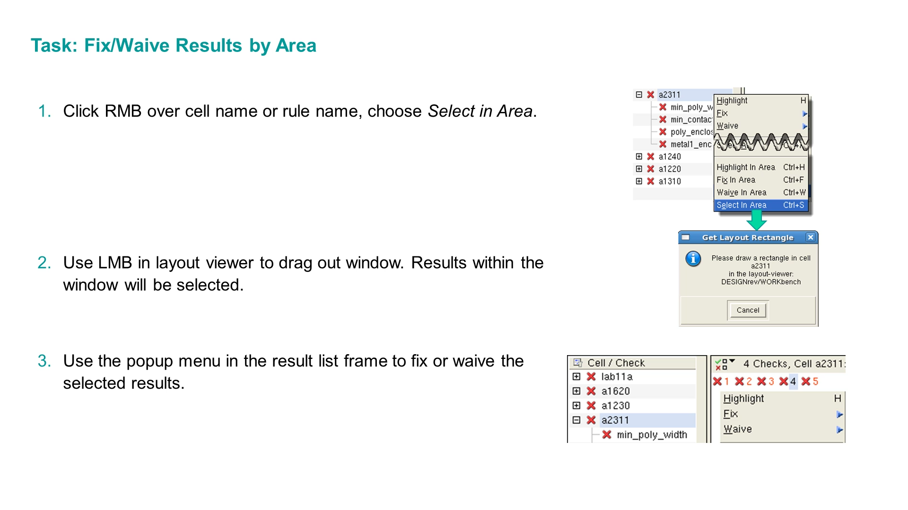

**Procedure:**

1. In the RVE result list, **right-click (RMB)** over a cell name or rule name.
2. From the context menu, choose **Select in Area** (keyboard shortcut: `Ctrl+S`).
3. RVE will prompt you with a **Get Layout Rectangle** dialog, instructing you to draw a rectangle in the layout viewer (DESIGNrev/WORKbench).
4. In the layout viewer, **drag the left mouse button (LMB)** to draw a selection rectangle. All DRC results with markers falling within this rectangle will be selected.
5. Return to the RVE result list — the selected results are now highlighted in the result list frame.
6. **Right-click** in the result list frame and choose either **Fix** or **Waive** from the popup menu to apply the desired status to all selected results.

---

### Task: Clear Fixed/Waived Highlights

When a result is fixed or waived, you may want its layout highlighting to disappear automatically rather than remaining visible. RVE provides a configuration option in the Setup Highlighting Options panel to enable this behavior.

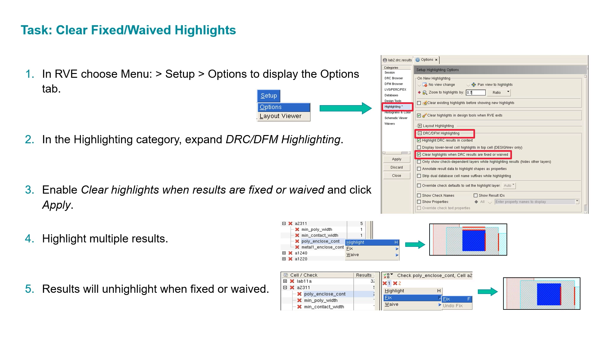

**Procedure:**

1. In RVE, navigate to **Menu: Setup > Options** to open the **Options** tab.
2. In the **Categories** list on the left, select **Highlighting**.
3. Expand the **DRC/DFM Highlighting** section.
4. Enable the option **Clear highlights when DRC results are fixed or waived**.
5. Click **Apply**.

**Behavior after enabling:**

- Highlight multiple results in the layout viewer using the RVE Highlight action.
- When you subsequently **Fix** one of those highlighted results, its corresponding highlight shape disappears from the layout — the remaining highlights for un-fixed/un-waived results remain visible.
- This makes it visually clear which errors still require attention.

---

### Importing Waived Results Files

Waiver information generated during a DRC run is automatically written to a file in the run directory. The filename follows the convention:

```
<results_db>.waived
```

where `<results_db>` is the name of the DRC results database file (e.g., `poly.rdb.waived`).

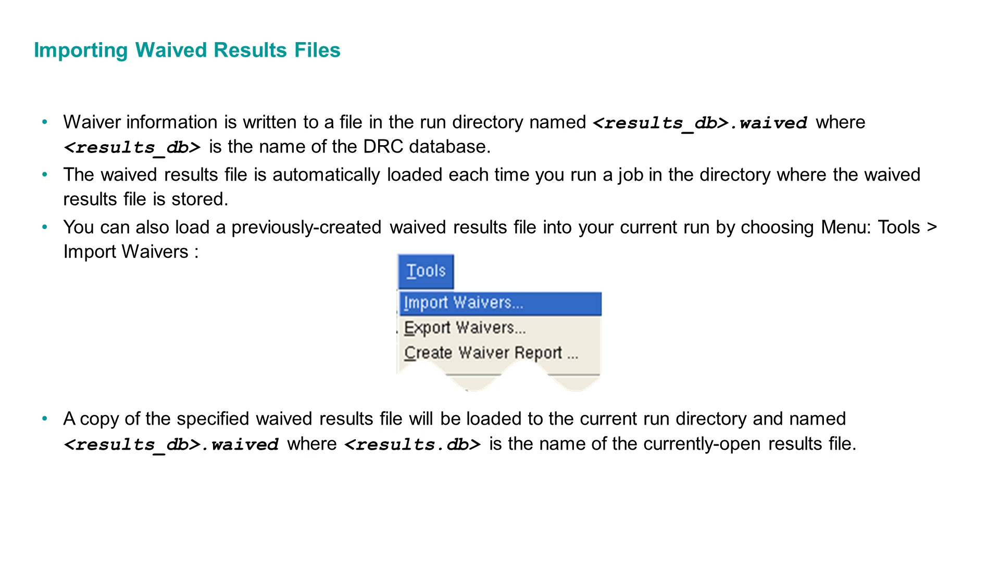

**Automatic loading behavior:**

The waived results file is automatically reloaded each time a new DRC job is executed in the same run directory. This ensures that previously waived results remain marked across consecutive runs without any manual intervention.

**Manually importing a waiver file from a different run:**

If you want to apply waivers from a previous run (or a different directory) into your current session, use:

```
Menu: Tools > Import Waivers
```

This opens a file browser where you can locate and select any `.waived` file. Upon import, Calibre copies the specified waived results file into the current run directory and renames it to match the current results database:

```
<results_db>.waived
```

where `<results.db>` is the name of the currently-open results file. This mechanism allows waiver sets from different tape-out iterations or design branches to be reused and consolidated.

---

### Preserving Cells With Error Waivers

When performing **hierarchical DRC**, Calibre uses internal heuristics to decide which cells to expand (flatten) for improved performance. For example, a small cell instantiated only once may be expanded inline into the parent cell context rather than being checked as a standalone unit.

**The problem:** The list of expanded cells can vary from one DRC run to the next because expansion decisions are based on run-time heuristics. If you have previously waived cell-resident errors and those cells are subsequently expanded in a new run, the waiver associations may no longer align correctly with the reported errors.

**The solution:** Use the **Cells** tab on the Calibre Interactive **Options** pane to explicitly preserve specific cells, preventing them from being expanded across runs.

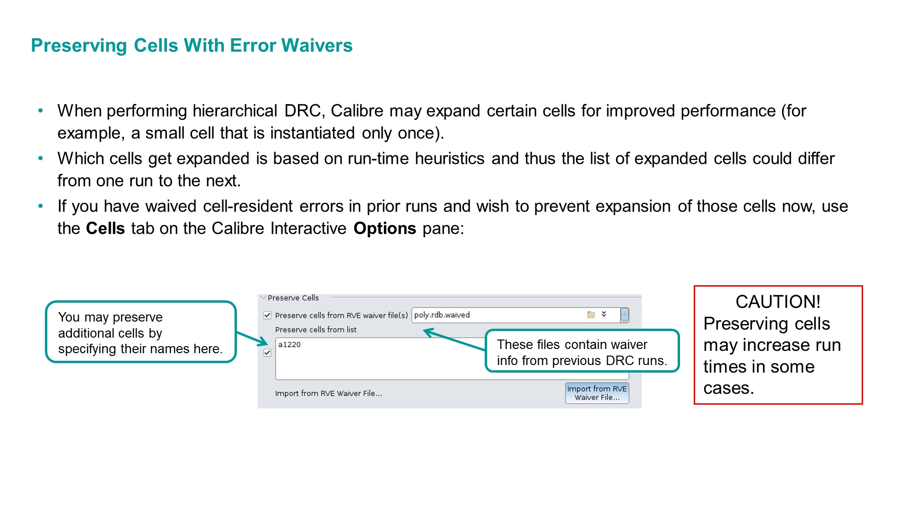

**Procedure:**

1. In Calibre Interactive, open the **Options** pane.
2. Navigate to the **Cells** tab.
3. Enable **Preserve cells from RVE waiver file(s)** and provide the path to your `.waived` file (e.g., `poly.rdb.waived`). These files contain waiver info from prior DRC runs.
4. Optionally, list **additional cells by name** in the "Preserve cells from list" field to force preservation of specific cells regardless of waiver status.
5. Use the **Import from RVE Waiver File...** button to populate the list automatically from an existing waiver file.

> ⚠️ **CAUTION:** Preserving cells may increase run times in some cases, because it prevents performance optimizations that rely on cell expansion. Use this feature selectively for cells that carry critical waivers.

---

## Module 3 — Additional RVE Features

### Objectives

- Viewing DRC results dynamically as they are generated during a run.
- Using result tables to sort, filter, and analyze result data.
- Displaying result properties associated with layout entities.
- Generating and customizing result histograms for statistical analysis.

---

### Using Additional RVE Features

Calibre RVE provides a rich set of result analysis capabilities beyond simple error navigation. This module covers four advanced features: dynamic result viewing, result tables, added properties, and histograms. Together, these features allow engineers to triage large result sets efficiently and extract quantitative insights from DRC output data.

---

### Viewing Dynamic Results in RVE

By default, RVE is launched and populated with results only after the entire DRC job has completed. The **Dynamic Results** feature changes this behavior, allowing RVE to display results **as they are generated**, even while the Calibre run is still in progress.

This is particularly valuable for large designs with long run times, where early visibility into errors can help engineers begin analysis and prioritization before the run finishes.

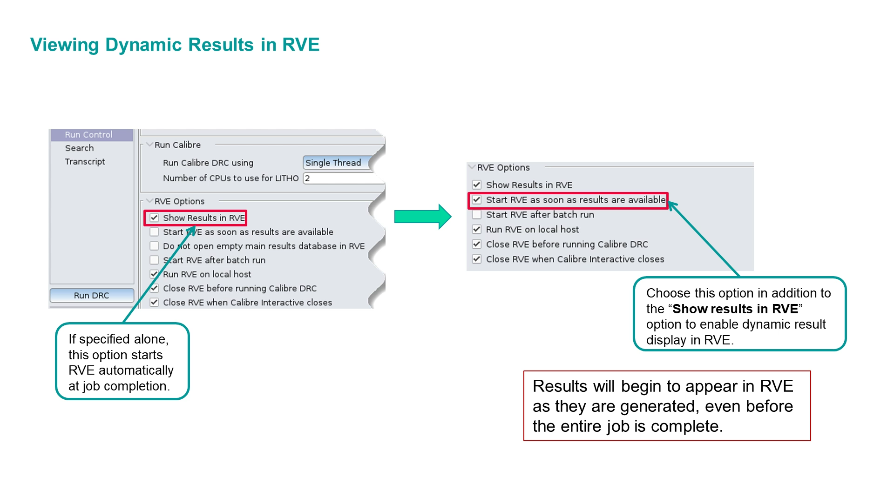

**Configuration:**

In the **Run Control** pane of Calibre Interactive, under **RVE Options**:

| Option | Behavior |
|--------|----------|
| **Show Results in RVE** (alone) | Starts RVE automatically at job completion |
| **Show Results in RVE** + **Start RVE as soon as results are available** | Launches RVE immediately and streams results in real-time as they are generated |

Enable both options to achieve full dynamic result display. Results will begin appearing in RVE while Calibre is still running, allowing immediate interactive exploration.

---

### RVE Result Tables

The default RVE results view presents errors in a hierarchical list format (List mode). For result sets that carry **numerical properties** — such as density values, areas, or spacings — the **Result Table** (Details) view provides a powerful spreadsheet-like interface for sorting and comparative analysis.

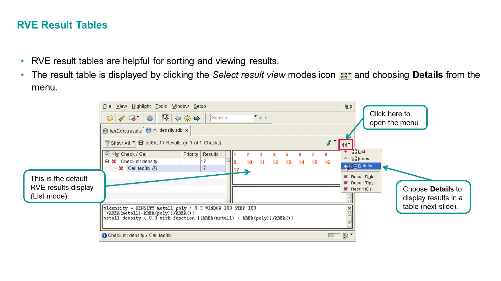

**Enabling the Result Table:**

1. In RVE, click the **Select result view modes** icon (grid icon in the toolbar).
2. From the dropdown menu, choose **Details**.
3. The result list transitions from a hierarchical tree to a tabular view with named columns corresponding to result properties.

**Using the Result Table:**

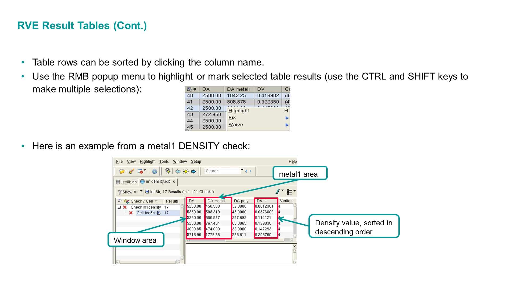

- **Sort by column:** Click any column header to sort results in ascending order; click again for descending order. This makes it easy to find the worst violators (e.g., the lowest density window).
- **Multi-selection:** Use `Ctrl+Click` and `Shift+Click` to select multiple rows simultaneously.
- **Context menu:** Right-click on selected rows to access **Highlight**, **Fix**, or **Waive** actions directly from the table.
- **Example use case:** In a `DENSITY` check, columns such as `DA` (window area), `DA metal1` (metal1 area within the window), `DA poly`, and `DV` (density value) are automatically populated. Sorting by `DV` in descending order immediately surfaces the highest-density violations.

---

### Displaying Added Properties

The Calibre SVRF language allows rule checks to **annotate result geometries with custom properties** using the `PROPERTY` statement. These properties are written to the RDB file alongside the standard result data and can be viewed directly in RVE.

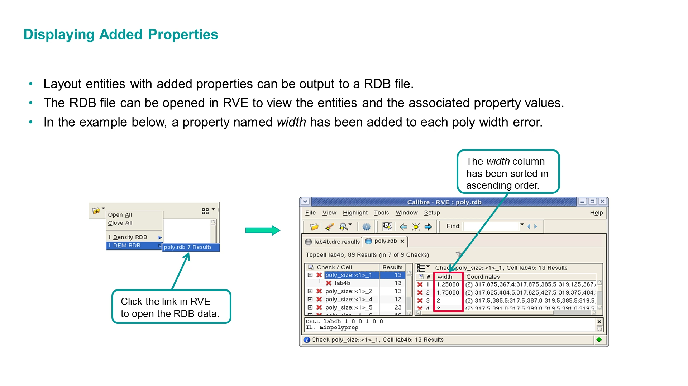

**How it works:**

- Layout entities with added properties are output to an RDB file.
- Opening the RDB file in RVE displays the entities along with their associated property values as additional columns in the result table.
- In the example shown, a property named `width` has been added to each poly width error, allowing the exact measured width to be viewed and sorted directly in the results interface.

**Viewing added properties in RVE:**

1. Click the link in the RVE result browser to open the RDB data file containing the property information.
2. Switch to **Details** view (Result Table mode) to see the custom property as a sortable column.
3. Click the property column header (e.g., `width`) to sort results by that value — for instance, to find the narrowest polygons that violated the minimum width rule.

**Displaying properties in the layout viewer (DESIGNrev):**

To annotate the actual highlighted geometry in the layout with property values:

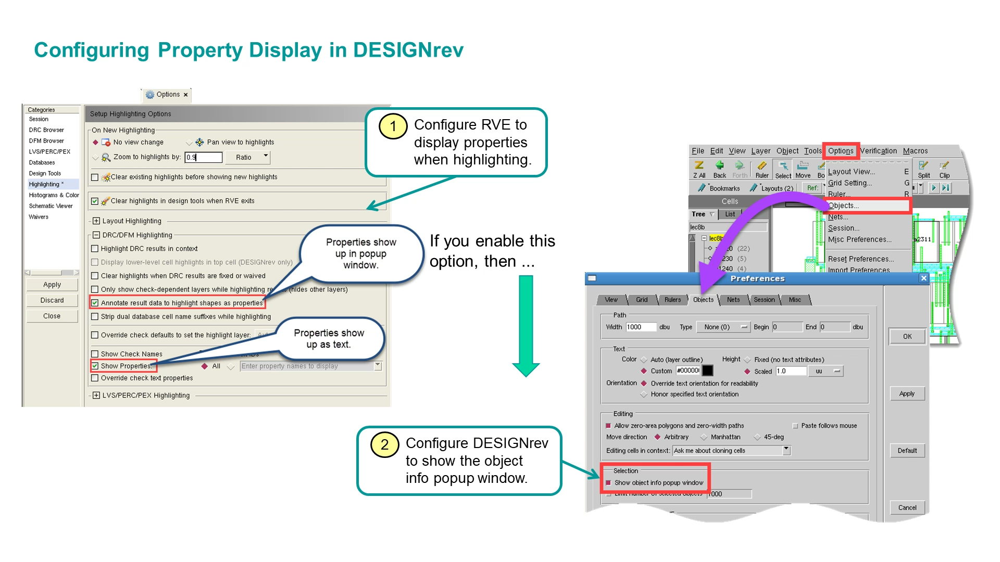

1. In RVE, go to **Setup > Options > Highlighting** and enable **Show Properties** and **Annotate result data to highlight shapes as properties**.
2. In DESIGNrev, go to **Options > Objects > Preferences** and enable **Show object info popup window** under the Selection section.

With both settings active, highlighting a result in RVE will display the associated property values as text annotations on the highlighted shape in the layout viewer, and also pop up the object info window.

---

### Creating RVE Histograms

RVE can generate **histograms** of numerical result property data, providing a statistical distribution view of DRC results. This is particularly useful for density checks, spacing analyses, or any check where understanding the distribution of values is as important as identifying individual violations.

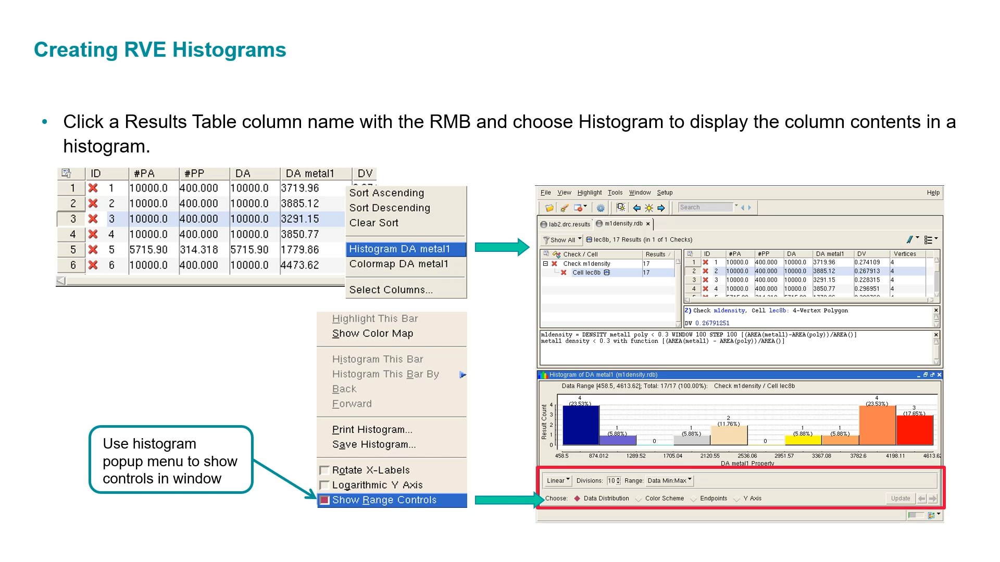

**Generating a histogram:**

1. Switch to **Details** (Result Table) view.
2. **Right-click on a column header** containing numerical data (e.g., `DA metal1`).
3. From the popup menu, choose **Histogram `<column name>`** (e.g., "Histogram DA metal1").
4. A separate histogram window opens, displaying result count on the Y-axis and property value ranges (bins) on the X-axis.
5. Use the **Show Range Controls** option at the bottom of the histogram popup menu to display the controls panel for customizing the histogram.

**Customizing histogram bins:**

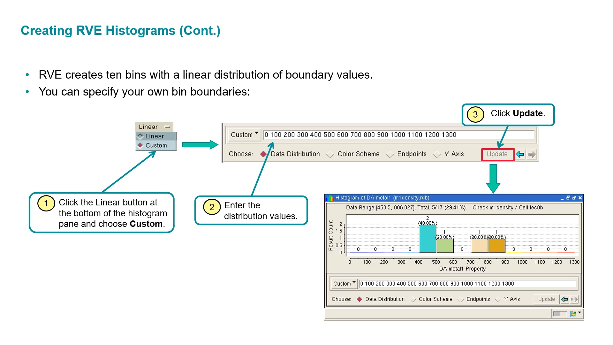

By default, RVE creates **10 bins** with linearly distributed boundary values spanning the full data range. You can override this with custom boundaries:

1. Click the **Linear** dropdown at the bottom of the histogram pane and select **Custom**.
2. Enter your desired boundary values as a space-separated list (e.g., `0 100 200 300 400 500 600 700 800 900 1000 1100 1200 1300`).
3. Click **Update** to regenerate the histogram with your custom bin definitions.

This allows you to focus the histogram on specific value ranges that are most relevant to your analysis (e.g., density values near the process limit).

---

### Configuring Property Display in DESIGNrev

When result properties are available and you want them to appear directly within the DESIGNrev layout viewer (not just in the RVE table), a two-step configuration is required.


**Step 1 — Configure RVE to annotate properties on highlighted shapes:**

In RVE, navigate to **Setup > Options > Highlighting** and enable:
- **Show Properties** — Activates property annotation on highlighted results.
- **Annotate result data to highlight shapes as properties** — Causes property values to appear as text labels directly on the highlighted geometry in the layout viewer.

**Step 2 — Configure DESIGNrev to show the object info popup window:**

In DESIGNrev, navigate to **Options > Objects > Preferences** and under the **Selection** section, enable:
- **Show object info popup window** — A popup window appears whenever you click on a highlighted shape, displaying all associated properties.

With both steps configured, you get dual visibility: properties appear as overlay text on the geometry **and** in a dedicated popup window, making them easy to read without interrupting your layout navigation workflow.

---

### Displaying Property Values in Cadence Virtuoso

For users working within the **Cadence Virtuoso** environment, property values associated with DRC results can be displayed using Virtuoso's built-in **Error Marker** mechanism.

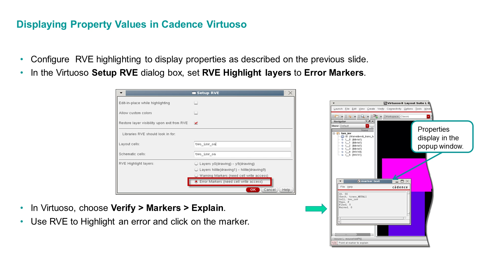

**Setup:**

1. Configure RVE highlighting to display properties as described in the DESIGNrev section above (enable **Show Properties** and **Annotate result data to highlight shapes as properties**).
2. In the Virtuoso **Setup RVE** dialog box, set **RVE Highlight layers** to **Error Markers (need cell write access)**. This instructs RVE to write error markers directly into the Virtuoso layout database.
3. In Virtuoso, navigate to **Verify > Markers > Explain**.
4. Use RVE to highlight a DRC error. Click on the corresponding marker in the Virtuoso layout canvas.
5. A **marker text** popup window appears in Virtuoso, displaying the result's ID, check name, cell, type, fixed status, and waived status.

> **Note:** Error Markers mode requires **cell write access** in Virtuoso. If write access is unavailable, use **Warning Markers** mode instead (read-only, but properties won't be annotated).

---

## Module 4 — Layout-versus-Layout (LVL) Options

### Objectives

- Using the **Layout Diff** tool embedded in Calibre DESIGNrev to visually compare two layouts.
- Running the standalone **DBdiff** command-line utility for high-speed database comparison.
- Using the **Fast XOR** option in Calibre Interactive as a GUI-driven alternative to DBdiff.

---

### Layout-Versus-Layout Overview

Layout-versus-Layout (LVL) comparison is the process of detecting geometric differences between two versions of a physical design database. This is essential in scenarios such as:

- Verifying that an ECO (Engineering Change Order) introduced only the intended modifications.
- Confirming that a GDS handoff from a foundry or IP provider matches the expected reference.
- Detecting unintended differences introduced during format conversion or database migration.

Three tools are available for LVL comparison in the Calibre environment:

| Tool | Access Method | Output Formats |
|------|---------------|----------------|
| **Layout Diff** | DESIGNrev → Tools > Layout Diff | RDB (opens in RVE) |
| **DBdiff** | Command-line utility | ASCII report + RDB |
| **Fast XOR** | Calibre Interactive GUI | RDB + ASCII report + geometric DB |

---

### Using the Layout Diff Tool in DESIGNrev

The **Layout Diff** tool is integrated directly into Calibre DESIGNrev, enabling layout comparison without leaving the viewing environment. It is the most accessible option for quick ad-hoc comparisons.

**Access:** In DESIGNrev, navigate to **Menu: Tools > Layout Diff**.

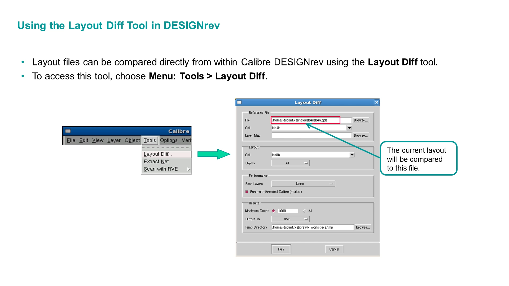

**Configuration parameters:**

| Parameter | Description |
|-----------|-------------|
| **Reference File** | Path to the reference (baseline) layout file for comparison |
| **Cell** | The top cell name within the reference file |
| **Layer Map** | Optional layer mapping file to reconcile layer number differences between databases |
| **Layout — Cell** | The current layout's top cell (auto-populated from the open design) |
| **Layers** | Scope of comparison: All layers, or a specific subset |
| **Maximum Count** | Maximum number of differences to report |
| **Output To** | Destination: RVE (default), or a file path |
| **Temp Directory** | Directory for intermediate temporary files during the run |

Click **Run** to execute the comparison.

**Interpreting Layout Diff results:**

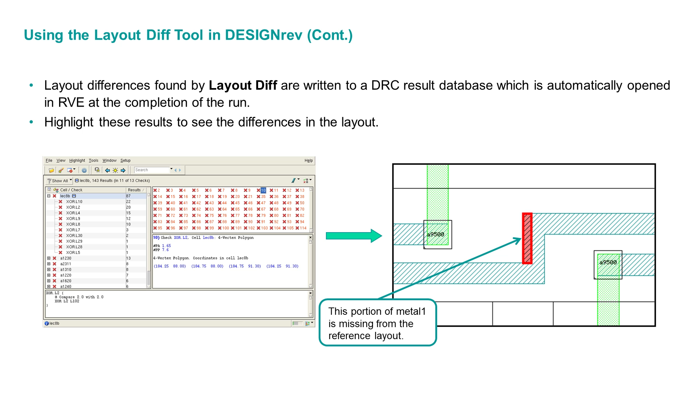

Layout differences found by Layout Diff are written to a DRC result database and automatically opened in RVE upon completion. The results are organized by XOR check per layer (e.g., `XORL2`, `XORL4`, `XORL10`). Highlighting a result in RVE shows the **exact geometry that differs** between the two layouts — for example, a segment of Metal1 that is present in the current layout but absent from the reference.

> Unlike some other comparison tools that highlight the *area* of difference, Layout Diff (like DBdiff) reports the actual *geometry* that is different, giving more actionable feedback.

---

### Using DBdiff to Compare Designs

**DBdiff** is a standalone command-line utility purpose-built for rapidly identifying differences between two layout databases. It operates independently of any GUI environment and is well-suited for integration into automated tape-out scripts or batch comparison flows.

**Supported input formats:**

- GDSII
- OASIS
- OpenAccess
- LEF/DEF

**Output options:**

- An **ASCII report** describing all differences found, including bounding boxes, layer/datatype information, and difference type (New Object / Missing Object)
- A **DRC result database (RDB)** that can be opened directly in Calibre RVE for interactive navigation and highlighting

**Key distinguishing characteristic:** Unlike tools that show the *area* where differences occur, DBdiff results show the **actual geometry** that is different — a more precise and actionable form of output.

**DBdiff command syntax:**

```bash
dbdiff -system {GDS|OASIS|LEFDEF|GDS|OA} \
       {-design design_file [design_cell]} \
       {-refdesign ref_file [ref_cell]} \
       [-rdb rdb_file] \
       [-report report_file] \
       [-template template_file]
```

**Arguments reference:**

| Argument | Description |
|----------|-------------|
| `-system` | Specifies the layout database format (GDS, OASIS, LEFDEF, OA) |
| `design_file design_cell` | Path to the design (current) layout file and its top cell name |
| `ref_file ref_cell` | Path to the reference layout file and its top cell name |
| `rdb_file` | Output path for the DRC result database file |
| `report_file` | Output path for the ASCII text difference report |
| `template_file` | Path to a template file that supplies all command-line arguments (an alternative to specifying them inline) |

> For a complete list of available options and advanced usage, refer to the **Calibre Verification User's Manual**.

**Template file approach:**

A template file allows all arguments to be stored in a configuration file and passed via a single command:

```bash
dbdiff -template dbdiff.template
```

This is the recommended approach for repeatable, scripted comparisons, as it keeps the argument set versioned and auditable alongside the design files.

---

### DBdiff Example

The following example demonstrates a complete DBdiff comparison between two versions of a design (`lab2_bad.gds` vs `lab2.gds`).

**Template file (`dbdiff.template`):**

```
# dbdiff template file for design "lab2"
#
-system GDS
-design lab2_bad.gds lab2
-refdesign lab2.gds lab2
-rdb dbdiff_results.db
-report dbdiff_report.rep
```

**Command line invocation:**

```bash
dbdiff -template dbdiff.template
```

**Results in RVE:**

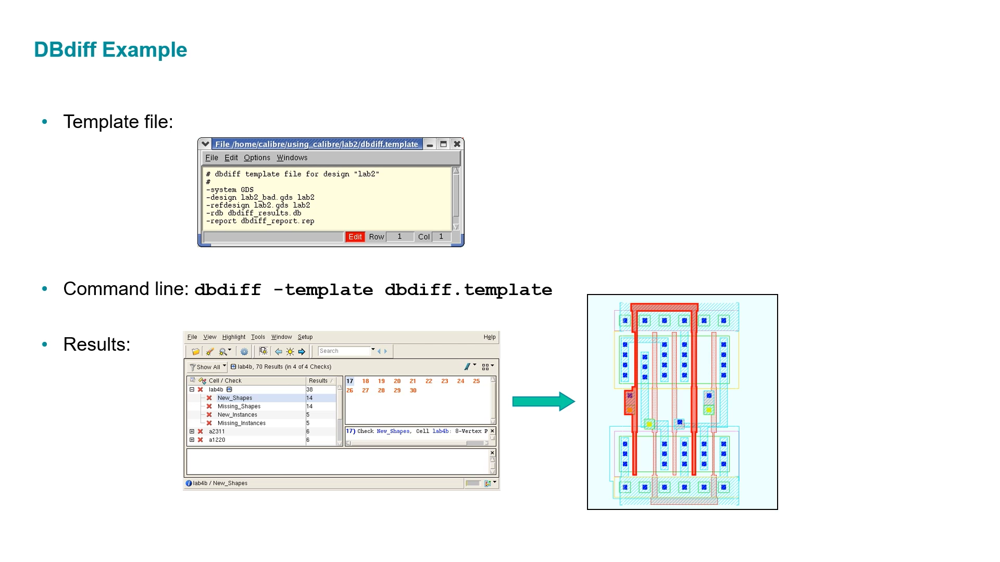

The RVE result list shows differences categorized by type:

| Category | Count | Meaning |
|----------|-------|---------|
| `New_Shapes` | 14 | Geometries present in `design` but absent in `refdesign` |
| `Missing_Shapes` | 14 | Geometries present in `refdesign` but absent in `design` |
| `New_Instances` | 5 | Cell instances added in the current design |
| `Missing_Instances` | 5 | Cell instances removed compared to the reference |

**ASCII Report file:**

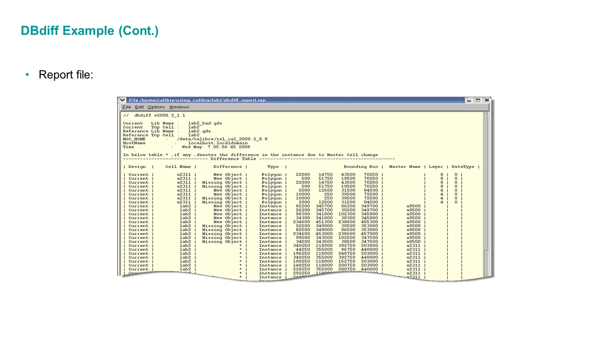

The generated text report (`dbdiff_report.rep`) contains a structured **Difference Table** with columns for: Design, Cell Name, Difference type (New Object / Missing Object), Type (Polygon / Instance), Bounding Box coordinates, Master Name, Layer, and DataType. This report is suitable for archiving, design reviews, and automated parsing.

---

### Using Fast XOR to Compare Designs

**Fast XOR** is the GUI-accessible interface to the DBdiff utility, available directly within **Calibre Interactive**. It provides all the power of DBdiff through a guided step-by-step interface, making it accessible without command-line expertise.

**How it works:** Fast XOR invokes the Calibre DBdiff utility internally. It requires an **XOR rule file** that defines how layers are compared. This rule file can be created manually in advance, or you can instruct Calibre Interactive to **auto-generate** the XOR rule file for you based on the layer information in the input layouts.

**Supported layout formats:**

- GDSII
- OASIS
- OpenAccess
- LEF/DEF

**Output options (three types):**

| Output Type | Description |
|-------------|-------------|
| **DRC result database (RDB)** | Can be opened in RVE for interactive cross-probing |
| **ASCII DRC summary report** | Text-format summary of differences |
| **Geometric database** | Can be opened in a layout viewer for visual inspection |

**Configuration in Calibre Interactive:**

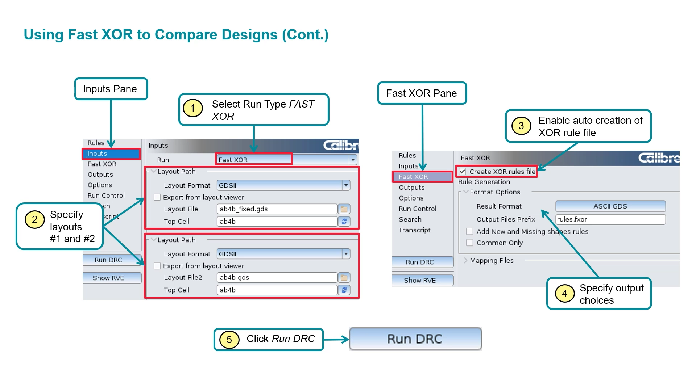

| Step | Location | Action |
|------|----------|--------|
| 1 | **Inputs pane** | Set **Run** type to **Fast XOR** |
| 2 | **Inputs pane — Layout Path (1)** | Specify the first layout file (`lab4b_fixed.gds`) and top cell (`lab4b`) |
| 3 | **Inputs pane — Layout Path (2)** | Specify the second layout file (`lab4b.gds`) and top cell (`lab4b`) |
| 4 | **Fast XOR pane** | Enable **Create XOR rules file** for automatic rule file generation |
| 5 | **Fast XOR pane** | Choose **Result Format** (e.g., `ASCII GDS`) and set **Output Files Prefix** (e.g., `rules.fxor`) |
| 6 | **Run DRC button** | Click **Run DRC** to execute the Fast XOR comparison |

**Interpreting Fast XOR output:**

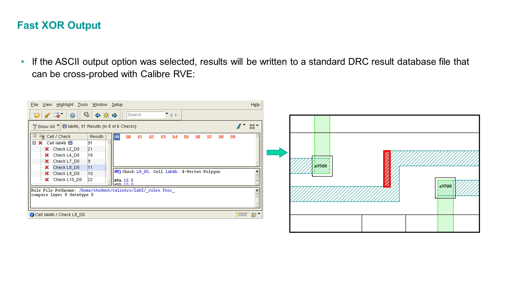

When the ASCII output option is selected, Fast XOR writes results to a standard DRC result database that can be cross-probed with Calibre RVE. Results are organized by layer (e.g., `Check L2_D0`, `Check L4_D0`, `Check L8_D0`), where each check corresponds to geometric differences on a specific layer/datatype combination.

Highlighting a result in RVE zooms the layout viewer to the exact location of the difference, showing the geometry that exists in one layout but is absent in the other — for example, a segment of Metal1 present in the fixed layout that was missing from the reference.

---

## Quick Reference Summary Table

| Feature | Location / Method | Key Setting / Command | Notes |
|---------|-------------------|----------------------|-------|
| DRC HTML Report | Calibre Interactive → Outputs pane | Enable **Create HTML Report** | GDS/OASIS input only |
| HTML Report auto-open | Outputs pane | Enable **View Report** | Opens browser post-run |
| Select checks by layer | Rules pane → Edit → Recipe Editor → Advanced | `DRC SELECT CHECK BY LAYER <layer>` | Use "Add" to include |
| Unselect checks by layer | Rules pane → Edit → Recipe Editor → Advanced | `DRC UNSELECT CHECK BY LAYER <layer>` | Use "Subtract" to exclude |
| Fix result | RVE result list → RMB → Fix | — | Cleared on next run |
| Waive result | RVE result list → RMB → Waive | — | Persists across runs |
| Fix/Waive by area | RVE → RMB → Select in Area | `Ctrl+S` | Draw rectangle in layout viewer |
| Clear highlights on fix/waive | RVE → Setup > Options > Highlighting | Enable **Clear highlights when results are fixed or waived** | Apply to take effect |
| Import waivers | RVE → Tools > Import Waivers | — | Copies to current run dir |
| Preserve cells | Calibre Interactive → Options → Cells tab | **Preserve cells from RVE waiver file(s)** | May increase run time |
| Dynamic results | Run Control → RVE Options | Enable **Start RVE as soon as results are available** | Requires "Show Results in RVE" also enabled |
| Result table view | RVE toolbar → grid icon → Details | — | Enables column sorting |
| Result histograms | Result Table → RMB on column header → Histogram | Custom bins: set to Custom, enter values, click Update | |
| Show properties in DESIGNrev | RVE Setup > Options > Highlighting | **Show Properties** + **Annotate result data** | Also enable DESIGNrev popup |
| Show properties in Virtuoso | Setup RVE dialog | **RVE Highlight layers → Error Markers** | Requires cell write access |
| Layout Diff | DESIGNrev → Tools > Layout Diff | Select reference file, click Run | Output to RVE |
| DBdiff (CLI) | Command line | `dbdiff -system GDS -design ... -refdesign ...` | Template file recommended |
| Fast XOR | Calibre Interactive → Inputs → Run: Fast XOR | Enable **Create XOR rules file** | GUI wrapper for DBdiff |

---

> **Navigation:**
> ← [Chapter 03 — nmDRC Job Customization](../chapter-03/README.md) &nbsp;|&nbsp; [Main README](../../README.md) &nbsp;|&nbsp; [Chapter 05 — nmLVS Basics](../chapter-05/README.md) →
