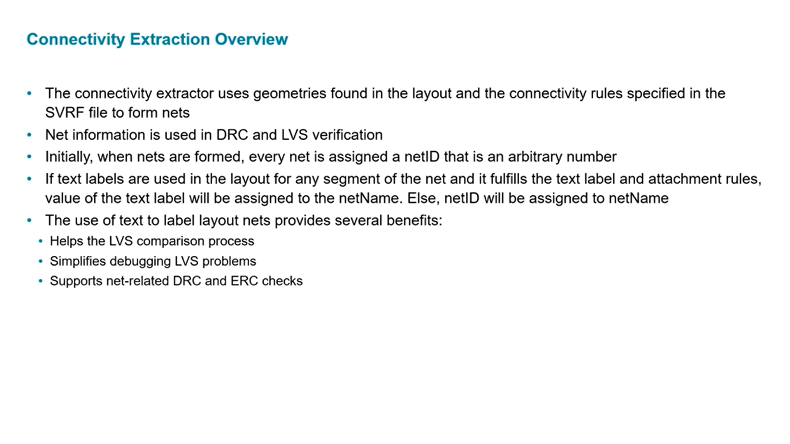
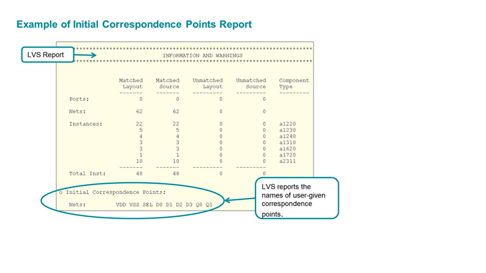
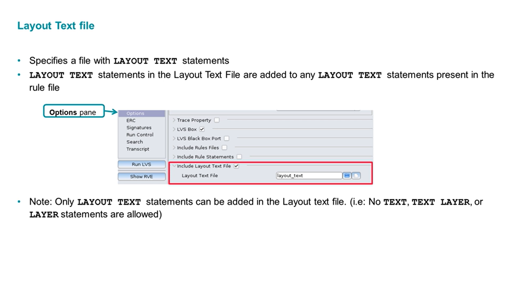
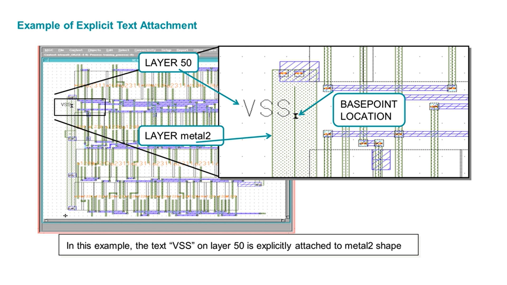
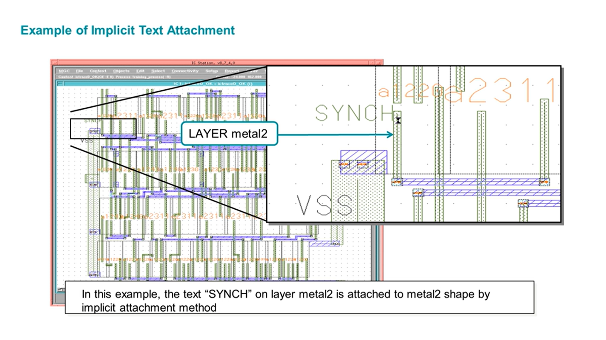
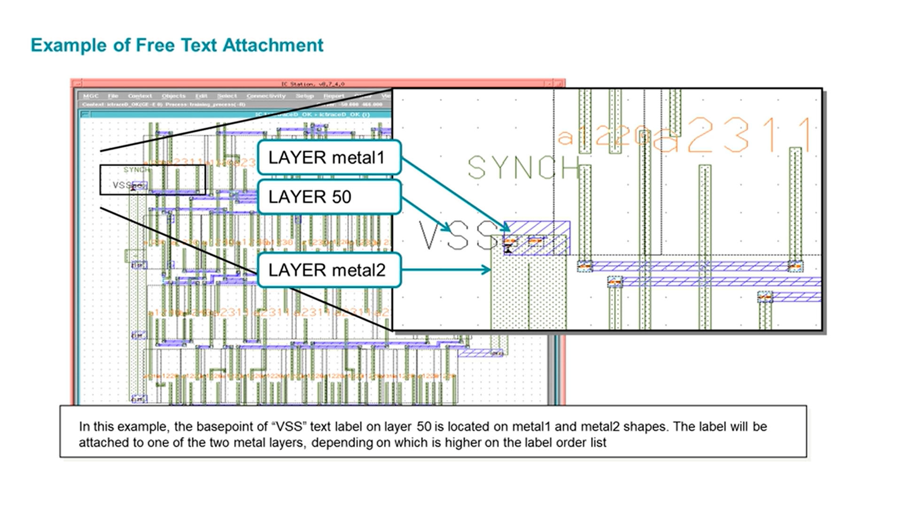
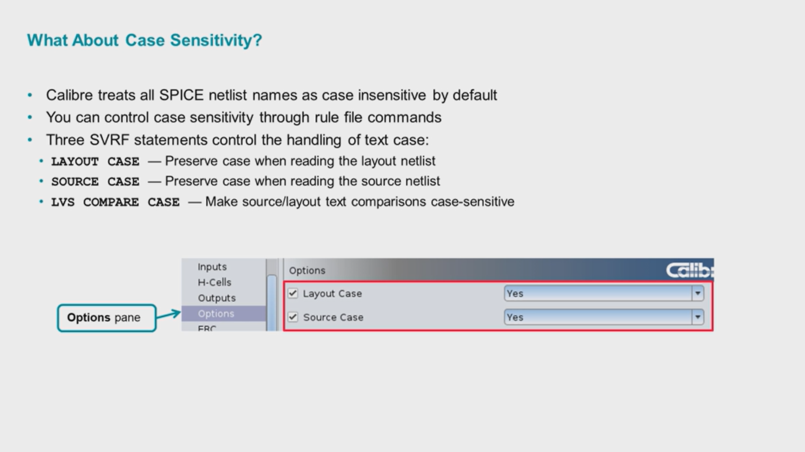
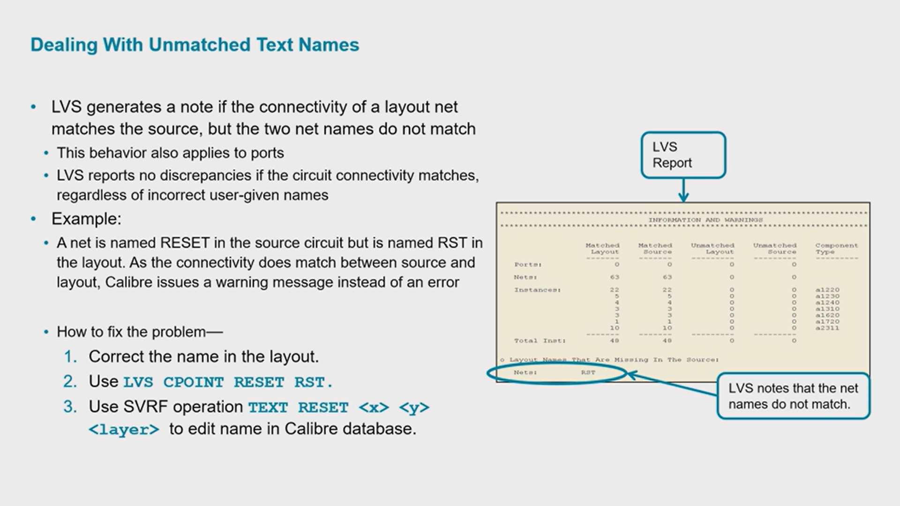
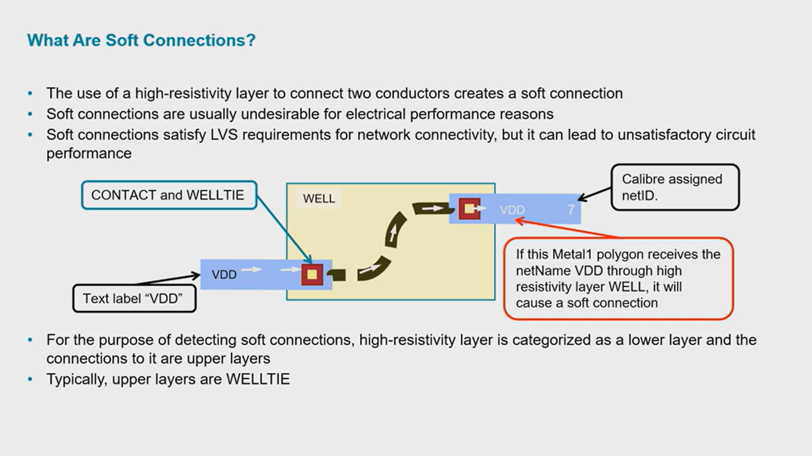
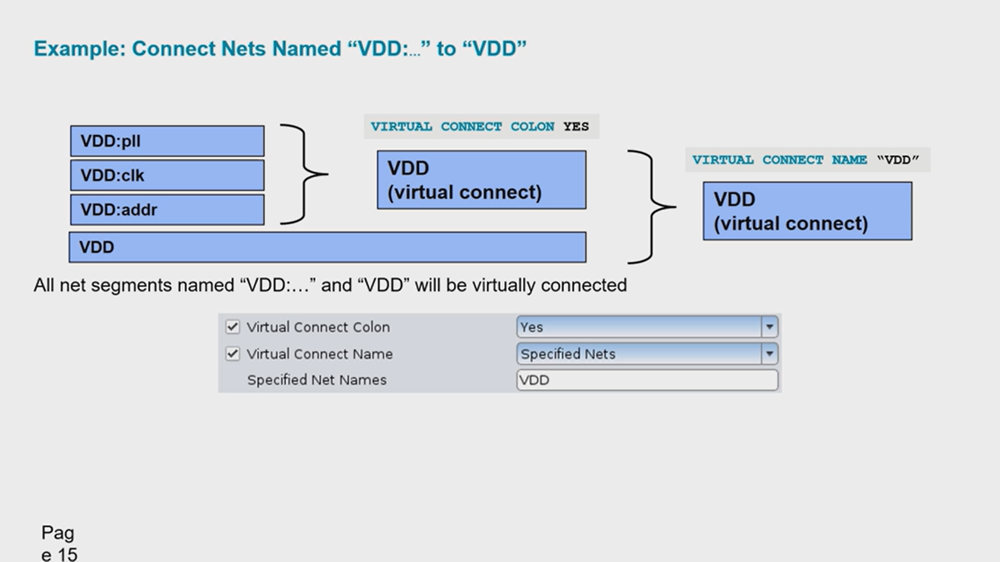

# Chapter 6 — Texting and Connectivity

> Calibre nmLVS Basics Series | How Calibre extracts nets from a layout, how text labels are used to name those nets, and how connectivity — including soft and virtual connections — is established and debugged.

---

## Table of Contents

1. [Connectivity Extraction Overview](#1-connectivity-extraction-overview)
2. [Working With Text](#2-working-with-text)
3. [Initial Correspondence Points](#3-initial-correspondence-points)
4. [Recognizing Hierarchical Text](#4-recognizing-hierarchical-text)
5. [Using the LAYOUT TEXT and TEXT Statements](#5-using-the-layout-text-and-text-statements)
6. [Attaching Text Labels to Target Objects](#6-attaching-text-labels-to-target-objects)
7. [Syntax Rules for Text Names](#7-syntax-rules-for-text-names)
8. [Case Sensitivity](#8-case-sensitivity)
9. [Debugging Common Texting Problems](#9-debugging-common-texting-problems)
10. [How Calibre Establishes Connectivity](#10-how-calibre-establishes-connectivity)
11. [Soft Connections](#11-soft-connections)
12. [Virtual Connectivity](#12-virtual-connectivity)
13. [Summary Reference Table](#13-summary-reference-table)

---

## 1. Connectivity Extraction Overview

The connectivity extractor is the Calibre engine that turns raw layout geometry into a netlist. It reads the shapes found in the layout together with the connectivity rules written in the SVRF rule file, and from that combination it builds **nets**.

Every net used in DRC and LVS verification carries net information that downstream checks depend on. When a net is first formed, Calibre doesn't yet know what a human would call it — it simply assigns the net an arbitrary **netID** (an internal number).

If a segment of that net happens to have a text label placed on it, and that label satisfies the text layer and attachment rules described later in this chapter, the *value* of the label becomes the net's `netName`. If no valid label is found, the net keeps its numeric `netID` as its name instead.

Because a net's readable name comes entirely from text placed in the layout, texting is not a cosmetic detail — it directly affects three things:

- **LVS comparison** — matching layout nets to schematic/source nets is far more reliable when both sides carry the same net names instead of arbitrary numbers.
- **Debugging LVS problems** — a mismatch report that says `VDD` vs `net23` is immediately actionable; two numeric IDs are not.
- **Net-related DRC and ERC checks** — many checks (e.g., short-circuit isolation on power/ground) depend on Calibre recognizing which net is which by name.



---

## 2. Working With Text

Text layout objects play an important role across DRC, ERC, and LVS. This chapter (and the chapters that follow it in the course) build up the full picture of how Calibre works with text:

- Using text objects to establish **initial correspondence points**
- Controlling **text recognition** (including in hierarchical designs)
- Using the rule file to **place text objects** (`LAYOUT TEXT` / `TEXT`)
- Specifying rules for **associating text objects with geometries** (attachment methods)
- **Text syntax** rules for valid names
- **Debugging** common texting problems

---

## 3. Initial Correspondence Points

When LVS starts a hierarchical comparison, it doesn't blindly try every possible pairing of layout and source nets — that would be an enormous search space. Instead, it uses net names that are **already known to match** (because the same name was texted in the layout and used in the source netlist) as fixed starting anchors. These are called **initial correspondence points**.

The LVS report explicitly lists which nets were used as initial correspondence points, which is useful both for confirming your texting is working and for debugging comparison failures.



In the example above, the LVS report's *Information and Warnings* section shows 62 matched nets and 48 matched instances with zero unmatched items on either side — a clean match. Below the summary table, the **Initial Correspondence Points** section lists the specific net names (`VDD VSS SEL D0 D1 D2 D3 Q0 Q1`) that the user supplied via text labels and that LVS used as its starting anchors.

---

## 4. Recognizing Hierarchical Text

### Which Layers Are Valid Text Layers

Calibre ignores every layout text object that isn't placed on a layer explicitly declared as a text layer:

- `TEXT LAYER` statements designate a layer as valid for **net** text.
- `PORT LAYER TEXT` statements designate a layer as valid for **port** text.

A detailed texting plan should always be part of the Process Design Kit (PDK) documentation. That plan lists every valid text layer used in verification, and shows which geometry layer each text layer corresponds to.

```
TEXT LAYER 50
PORT LAYER TEXT 51
```

### Task: Recognize Hierarchical Text

Where Calibre looks for text depends on the type of run:

- In **flat nmLVS** applications, and in **hierarchical nmDRC**, only text placed in the **top-level cell** is used for connectivity extraction.
- In **hierarchical nmLVS**, text objects from *all* levels of the hierarchy are used, in the cells in which they appear.

The `TEXT DEPTH` statement overrides this default behavior, forcing text placed in specified lower levels to be recognized as if it originated at the top:

```
TEXT DEPTH {ALL | PRIMARY | number}
```

| Value | Behavior |
|---|---|
| `PRIMARY` (default) | Only uses text from the top cell (flat), or as local text in the cells in which it appears (hierarchical) |
| `ALL` | Uses text from all levels of the hierarchy as if it originated at the top level |
| *number* | Uses text from the top level through the given level number, as if it originated at the top level |

A useful shorthand: `TEXT DEPTH 0` is equivalent to `TEXT DEPTH PRIMARY`.

```
TEXT DEPTH PRIMARY   ⇔   TEXT DEPTH 0
```

### Hierarchical Text Example

The diagram below shows the practical consequence of the `TEXT DEPTH` setting. A sub-cell `a1310` has pins `IN` and `OUT`, and two instances of it are placed into the top-level cell `text_hier`. In the sub-cell, both pins carry the same text labels (`IN`, `OUT`) since the same layout is instanced twice.


- With the **default** `TEXT DEPTH 0` (PRIMARY), each instance of `a1310` keeps its own local `IN`/`OUT` labels scoped to that instance — the extracted netlist correctly nets `X0` and `X1` as separate connections (`2 1`, `1 3`), and no warnings are generated.
- With `TEXT DEPTH ALL`, the *same* `IN`/`OUT` labels from the sub-cell are treated as if they originated at the top level. Because both instances now contribute a net literally named `IN` (and `OUT`) at the top level, Calibre reports:
  - **A short circuit** — two different names (`IN` and `OUT`) found on one net, because they were forced together at the top.
  - **An open circuit** — the same name `IN` appearing on two different nets, because the two instances' `IN` pins were never physically connected.

This example is a good illustration of why `TEXT DEPTH ALL` should be used deliberately, only when the texting plan calls for it — using it by default on a design with repeated hierarchy can create spurious shorts and opens.

---

## 5. Using the LAYOUT TEXT and TEXT Statements

Sometimes your layout data doesn't already include every text object you'd like to use for initial correspondence points. SVRF gives you two statements that let you inject text directly from the rule file rather than relying solely on what's physically drawn in the layout.

### Using the LAYOUT TEXT Statement

`LAYOUT TEXT` inserts a text object into the layout data **input stream**, before Calibre processes it. Because of this, `LAYOUT TEXT` placements:

- Behave exactly as if they existed in the original layout
- Can be placed into any level of the layout hierarchy
- Attach to geometries using **cell-space coordinates**
- Obey `TEXT LAYER` and `TEXT DEPTH` statements, just like real layout text

**Syntax:**

```
LAYOUT TEXT text_label x_loc y_loc layer cell_name
```

| Parameter | Meaning |
|---|---|
| `text_label` | Text string inserted into the layout input stream |
| `x_loc, y_loc` | Cell-space coordinates of the text label's reference point |
| `layer` | Layer the text will be placed on |
| `cell_name` | Cell the text will be placed in |

**Example:**

```
LAYER M2_TXT 50                                // Define layer as a text layer
TEXT LAYER M2_TXT                              // Label the layer
LAYOUT TEXT CLOCK 10.5 16.8 M2_TXT NAND2        // place text
```

Instead of writing `LAYOUT TEXT` statements directly into the rule file, you can point Calibre at a separate **Layout Text File** containing them:



`LAYOUT TEXT` statements found in the Layout Text File are simply *added* to any `LAYOUT TEXT` statements already present in the rule file. Only `LAYOUT TEXT` statements are permitted in this file — `TEXT`, `TEXT LAYER`, and `LAYER` statements are not allowed there.

### Using the TEXT Statement

The `TEXT` statement is a second way to insert text, but its behavior differs from `LAYOUT TEXT` in an important way: `TEXT` inserts text data into the Calibre **internal database** *after* the original GDS data has already been streamed in. Because of this:

- `TEXT` placements can **only** be made in the **top-level cell**, using **top-cell coordinates**
- `TEXT` placements do **not** obey `TEXT LAYER` or `TEXT DEPTH` statements
- `TEXT` placements **can edit (overwrite)** existing database text

**Syntax:**

```
TEXT text_label x_loc y_loc layer
```

| Parameter | Meaning |
|---|---|
| `text_label` | Text string inserted into the Calibre database |
| `x_loc, y_loc` | Top-cell space coordinates of the text label's reference point |
| `layer` | Layer the text will be placed on |

**Example:**

```
TEXT reset 20.0 12.5 METAL1
```

> **`LAYOUT TEXT` vs. `TEXT` — the key distinction:** `LAYOUT TEXT` behaves like it was always part of the layout (any cell, obeys `TEXT LAYER`/`TEXT DEPTH`), while `TEXT` is a top-level-only database edit that ignores those statements but can overwrite existing text.

---

## 6. Attaching Text Labels to Target Objects

Placing a text label near a shape isn't enough on its own — Calibre needs a defined rule for deciding which geometry a given label actually names. Text can be attached to target objects using any of three methods, tried in priority order:

| Priority | Method | Requirement |
|---|---|---|
| **Highest** | Explicit Attachment | Requires an `ATTACH` statement that specifies the text layer and the geometry layer |
| Lower | Implicit Attachment | Requires the text layer and geometry layer to be the **same** layer |
| **Lowest** | Free Attachment | Requires a `LABEL ORDER` statement providing a text layer and an ordered list of geometry layers |

The creator of the PDK rule deck chooses which method(s) to use and documents how text should be applied in the PDK documentation supplied with the process.

### Example of Explicit Text Attachment



Here, the text `VSS` lives on `LAYER 50` — a dedicated text layer, separate from any drawn geometry layer. An `ATTACH` statement in the rule file explicitly tells Calibre to associate `LAYER 50` text with `metal2` shapes. Calibre finds the text's **basepoint location** and attaches the label to whichever `metal2` polygon contains that point.

### Example of Implicit Text Attachment



In implicit attachment, there's no separate `ATTACH` statement needed — the text `SYNCH` is drawn directly **on** `LAYER metal2`, the same layer as the geometry it's meant to label. Because the text layer and the geometry layer are identical, Calibre implicitly attaches the label to the metal2 shape beneath its basepoint.

### Example of Free Text Attachment



Free attachment resolves ambiguity when a label's basepoint physically overlaps *more than one candidate layer* — in this example, the basepoint of the `VSS` label on `LAYER 50` sits above both a `metal1` shape and a `metal2` shape. Since there's no explicit `ATTACH` rule and the text isn't drawn on the same layer as either metal, Calibre falls back to the **`LABEL ORDER`** statement: the label is attached to whichever of the candidate geometry layers appears higher (earlier) in that ordered list.

---

## 7. Syntax Rules for Text Names

Text names aren't free-form strings — Calibre and SPICE both impose formatting rules that determine whether a name is valid.

**For layout databases:**

- Names cannot begin with `n$`, `N$`, `i$`, or `I$` (these prefixes are reserved for Calibre's own internally generated names)
- Names can contain only **one** leading `/` character — if a leading slash is present, it is simply ignored

**For user-given names to be valid in SPICE netlists:**

- Names must contain **at least one non-numeric character** (a name that is purely digits looks like an arbitrary netID, not a real name)
- Names can contain only **one** leading `/` character — same rule as above, and again it's ignored if present

---

## 8. Case Sensitivity

### What About Case Sensitivity?

By default, Calibre treats all SPICE netlist names as **case insensitive** — `VDD`, `Vdd`, and `vdd` are all treated as the same name. This behavior is controllable through rule file commands. Three SVRF statements control the handling of text case:

| Statement | Effect |
|---|---|
| `LAYOUT CASE` | Preserve case when reading the **layout** netlist |
| `SOURCE CASE` | Preserve case when reading the **source** netlist |
| `LVS COMPARE CASE` | Make source/layout text **comparisons** case-sensitive |



### Preserving Case Sensitivity

Calibre arbitrarily maps all netlist text to either upper case or lower case internally. To disable that mapping and preserve the original text case as written, use `LAYOUT CASE` / `SOURCE CASE`:

```
LAYOUT CASE {NO | YES}
SOURCE CASE {NO | YES}
```

| Value | Meaning |
|---|---|
| `NO` (default) | Calibre does **not** preserve case |
| `YES` | Calibre **does** preserve case |

These statements apply to model names, node names, subcircuit names, and user-defined parameter names. `LAYOUT CASE` and `SOURCE CASE` are independent of each other and do not need to be specified together. Both statements apply only to SPICE netlists.

### Making Comparisons Case Sensitive

Preserving case is only half the story — comparisons still need to be told to actually *use* that case when matching names. `LVS COMPARE CASE` controls that:

```
LVS COMPARE CASE {NO | YES | {[NAMES] [TYPES] [SUBTYPES] [VALUES]}}
```

| Value | Meaning |
|---|---|
| `YES` | All comparisons are case sensitive. `LAYOUT CASE` and `SOURCE CASE` should also be set to `YES` |
| `NO` | All comparisons are case-insensitive |
| `NAMES` | Net, instance, and port names are case-sensitive |
| `TYPES` | Component types are case-sensitive |
| `SUBTYPES` | Component subtypes are case-sensitive |
| `VALUES` | Property values expressed as strings are case-sensitive |

If case sensitivity is enabled, cell names specified in the `hcell` file automatically become case-sensitive as well.

---

## 9. Debugging Common Texting Problems

### Dealing With Unmatched Text Names

LVS generates a **note** — not an error — whenever the connectivity of a layout net matches the source, but the two net names themselves don't match. This same behavior also applies to ports. Importantly, **LVS reports no discrepancies if the circuit connectivity matches**, regardless of whether the user-given names are correct.

**Example:** a net is named `RESET` in the source circuit but `RST` in the layout. Since the connectivity still matches between source and layout, Calibre issues a warning instead of an error.



**How to fix the problem:**

1. Correct the name in the layout.
2. Use `LVS CPOINT RESET RST` to tell LVS the two names refer to the same net.
3. Use the SVRF operation `TEXT RESET <x> <y> <layer>` to edit the name directly in the Calibre database.

### Dealing With Incorrectly-Placed Text in the Layout

Incorrectly placed text can produce a few distinct failure patterns:

**Two or more different names found on a single net** — LVS generates a warning. The netlist extractor picks a power/ground name if one is present; otherwise it picks the last name alphabetically and discards the rest.

```
VDD   XYZ   →   VDD
```

**The same name assigned to two or more different nets** — LVS generates a warning. The extractor arbitrarily assigns the texted name to one net, and assigns an arbitrary number to the other.

```
XYZ   XYZ   →   22   XYZ
```

**A layout text name matches a valid source net name, but the physical net topology doesn't match the source net** — LVS generates a discrepancy.

**To resolve these errors, check:**

- Text location, layer, and cell parameters
- Text label attachment rules (priority, `LABEL ORDER`, etc.)

### Dealing With Unrecognized Layout Text

If expected text simply isn't found in the layout at all, two categories of problems appear:

**Features dependent on power/ground names stop working**, including:
- Short-circuit isolation on power/ground nets
- Logic gate recognition
- The `LVS ABORT ON SUPPLY ERROR` specification

**The benefits of initial correspondence points are lost**, including:
- Circuit ambiguity resolution
- Improved run-time execution
- Debugging improvement

**To resolve these issues, check:**

- Text location, layer, and cell parameters
- Whether text labels are placed according to the method specified by the PDK

### How to Identify Power/Ground Texting Problems

Incorrectly named power/ground nets produce one of several distinct LVS responses:

| Condition | LVS response |
|---|---|
| Name violates the syntax rules | Reports **`Badly formed power/ground net name`** |
| Same name used for both a power net and a ground net | Reports **`Contradictory power/ground net name`** |
| Other power/ground text issues | LVS **aborts**, with `OVERALL COMPARISON RESULTS` listed as **`NOT COMPARED`** |

This abort-on-error behavior can be overridden with:

```
LVS ABORT ON SUPPLY ERROR NO
```

---

## 10. How Calibre Establishes Connectivity

### Connecting Geometries

Calibre supports **three types of connection** between geometries:

- **Hard connections** — the connectivity of intersecting geometries on drawn and derived layers is determined by the `CONNECT` statement.
- **Soft connections** — connectivity through high-resistivity material, controlled by `SCONNECT`, which can be used to constrain extraction so it does *not* allow soft connections.
- **Virtual connections** — same-named geometries contribute to a single extracted net even if there are physical pieces missing between them.

For a hard connection specifically: if one of the two connecting geometries already belongs to a texted net, that net's ID is passed on to the other geometry.

### How Does Calibre Establish Connectivity?


The base rules Calibre applies when deciding whether two shapes are connected:

- **Touching or overlapping shapes on the same layer are connected.** Two `Metal1` rectangles that touch or overlap form a single net.
- **Shapes touching at only a single point are *not* connected.** A corner-to-corner touch is not sufficient — Calibre requires a real overlap or edge-touch, not a point-touch.
- **Shapes on the same metal separated by datatype may be connected if they touch or overlap**, but this behavior must be explicitly specified in the PDK documentation. In the example, `PWR_M1` and `SIG_M1` (same metal, different datatypes) touch and would only connect if the PDK defines that as valid.
- **Overlapping shapes on two different layers require the correct contact/via layer.** A `Metal1`–`Metal2` overlap needs a `Via1` at the overlap to be a valid connection; a `Metal1`–`Poly` overlap needs a `Contact`. Without the correct contact layer — or with the wrong one — the connection is not valid.

---

## 11. Soft Connections

### What Are Soft Connections?

A **soft connection** is created whenever a high-resistivity layer is used to connect two conductors. Soft connections are usually undesirable from an electrical performance standpoint — even though they satisfy LVS's requirement for network connectivity, they can lead to unsatisfactory circuit performance in practice (excess resistance where a low-resistance path was intended).



In this example, a `Metal1` shape carrying the text label `VDD` connects, through `CONTACT` and `WELLTIE` shapes, into the high-resistivity `WELL` layer, and from there to another `Metal1` polygon on the far side of the well. Because the connection path runs through the high-resistivity `WELL`, the second polygon receiving the `VDD` net name via that path constitutes a soft connection.

For the purpose of *detecting* soft connections, the high-resistivity layer is categorized as a **lower layer**, and the conductive layers connecting into it are categorized as **upper layers**. Typically, the upper-layer connection to a well is a `WELLTIE` shape.

### Reporting Soft Connection in Extraction Report

When two or more nets connect to the same well, only **one** netID or netName can be passed through to the well — the rest are rejected.


By default, the extraction report only shows a generic warning:

```
WARNING: Stamping conflict in SCONNECT - Multiple source nets stamp one
         target net.
         Use LVS REPORT OPTION S or LVS SOFTCHK statement to obtain
         detailed information.
```

Enabling **`LVS REPORT OPTION S`** (via the Options pane, `LVS Report Option` checked with keyword `S`) produces a far more actionable report that names exactly which net was selected and which were rejected:

```
WARNING: Stamping conflict in SCONNECT - Multiple source nets stamp one
         target net.
         Net VDD is selected for stamping.
         Rejected nets: 7
```

### Reporting Soft Connection in RVE

For interactive debugging in RVE, use the `LVS SOFTCHK` statement:

```
LVS SOFTCHK lower_layer report_layer
```

`report_layer` can be `LOWER`, `UPPER`, or `CONTACT`.


Depending on which `report_layer` argument is used, `LVS SOFTCHK WELL LOWER` flags the `WELL` polygon itself, while `LVS SOFTCHK WELL UPPER` flags the `WELLTIE` polygon connecting into it. The results database is named `layout_primary.softchk` or `lvs.softchk`, and it's stored in the `svdb` directory. To view these results, click the **Softchk Database** link under the RVE Navigator's Results/ERC section, then cross-probe just like DRC results.

---

## 12. Virtual Connectivity

### Virtual Connectivity — Concept

Normally, if the layout connectivity extractor finds **disjoint, unconnected geometries that share the same net name text**, it treats this as an **open circuit** — physically separate pieces of metal with the same label are not automatically assumed to be the same net.

**Virtual connection** changes this: it results in the extraction of a *single* net from two or more physically disjoint nets, purely because the physical net segments share the same name. Virtual connectivity is triggered by the rule file statements `VIRTUAL CONNECT COLON` and `VIRTUAL CONNECT NAME`, and can also be specified interactively through the Calibre Interactive GUI.

### Task: Specify VIRTUAL CONNECT NAME

```
VIRTUAL CONNECT NAME name1 name2 ... nameN
```

`VIRTUAL CONNECT NAME name1 name2` connects disjoint nets that share the name `name1` to each other, and *separately* connects disjoint nets that share the name `name2` to each other — but **`name1` nets are NOT connected to `name2` nets**. The statement may be used multiple times, and net names may contain the wildcard character `?`.


The GUI's **"All Nets by Name"** option is equivalent to writing `VIRTUAL CONNECT NAME "?"` — i.e., virtually connect every set of same-named disjoint nets in the design. The related statement `VIRTUAL CONNECT DEPTH` controls the hierarchical depth to which virtual connections are made.

**Example: Connect All "ADDR…" Nets**

```
VIRTUAL CONNECT NAME ADDR?
```

This connects net segments named `ADDR00` to each other, connects net segments named `ADDR01` to each other, and so on for every distinct name matching the `ADDR?` wildcard — but it does **not** connect `ADDR00` segments to `ADDR01` segments. Each distinct name gets its own virtual net.

### Task: Specify VIRTUAL CONNECT COLON

```
VIRTUAL CONNECT COLON {NO | YES}
```

If `YES` is specified, net segments whose names match up to (and including) the **first colon character** encountered are extracted as a single net. A few important constraints:

- Applies **only to top-level nets**
- The colon itself is **discarded** in the resulting extracted net name
- This statement can be used **only once** per run
- Both `VIRTUAL CONNECT COLON` and `VIRTUAL CONNECT NAME` can be included in the same run

```
VIRTUAL CONNECT COLON YES
```

**Example: Connect Nets Named "VDD:…"**


With `VIRTUAL CONNECT COLON YES`, nets named `VDD:pll`, `VDD:clk`, and `VDD:addr` are all virtually merged into a single net (extracted simply as `VDD`, with the colon suffix discarded). Critically, if there's a *separately named* net that is just `VDD` (no colon), it will **not** be virtually connected to the `VDD:...` nets — matching is based on exact text up to the colon, and a plain `VDD` net doesn't match the colon-prefix pattern used to group the others. That plain `VDD` net will instead be extracted as an open circuit relative to the group.

**Example: Connect Nets Named "VDD:…" to "VDD"**



To also fold that separate `VDD` net into the group, combine both statements — `VIRTUAL CONNECT COLON YES` first merges the colon-named nets into `VDD`, and then `VIRTUAL CONNECT NAME "VDD"` merges that result with the plain `VDD` net:

```
VIRTUAL CONNECT COLON YES
VIRTUAL CONNECT NAME VDD
```

With both statements active, all net segments named `VDD:...` and the segment simply named `VDD` are virtually connected into one net.

---

## 13. Summary Reference Table

| Feature | SVRF Statement | GUI Location |
|---|---|---|
| Valid text layer for nets | `TEXT LAYER` | Rules pane |
| Valid text layer for ports | `PORT LAYER TEXT` | Rules pane |
| Hierarchical text recognition depth | `TEXT DEPTH {ALL \| PRIMARY \| number}` | Rules pane |
| Insert text into layout input stream | `LAYOUT TEXT text_label x_loc y_loc layer cell_name` | Rules pane / Layout Text File |
| Point to an external file of `LAYOUT TEXT` statements | *(file reference)* | Options → Include Layout Text File |
| Insert/overwrite text in top-level Calibre database | `TEXT text_label x_loc y_loc layer` | Rules pane |
| Explicit text-to-geometry attachment | `ATTACH text_layer geometry_layer` | Rules pane |
| Free text-to-geometry attachment priority | `LABEL ORDER` | Rules pane |
| Preserve layout netlist case | `LAYOUT CASE {NO \| YES}` | Options pane |
| Preserve source netlist case | `SOURCE CASE {NO \| YES}` | Options pane |
| Make comparisons case-sensitive | `LVS COMPARE CASE {NO \| YES \| NAMES \| TYPES \| SUBTYPES \| VALUES}` | Options pane |
| Map an unmatched layout name to a source name | `LVS CPOINT layout_name source_name` | Rules pane |
| Disable abort on power/ground text errors | `LVS ABORT ON SUPPLY ERROR NO` | Rules pane |
| Define hard-connection rules | `CONNECT` | Rules pane |
| Constrain/control soft connections | `SCONNECT` | Rules pane |
| Report soft-connection detail in extraction report | `LVS REPORT OPTION S` | Options pane |
| Report soft-connection detail in RVE | `LVS SOFTCHK lower_layer report_layer` | Rules pane → RVE Softchk Database |
| Virtually connect same-named disjoint nets | `VIRTUAL CONNECT NAME name1 name2 ... nameN` | Options → Virtual Connect → Virtual Connect Name |
| Virtually connect nets matching up to first colon | `VIRTUAL CONNECT COLON {NO \| YES}` | Options → Virtual Connect → Virtual Connect Colon |
| Control hierarchical depth of virtual connections | `VIRTUAL CONNECT DEPTH` | Options → Virtual Connect |

---

### A Note on Screenshots

This chapter's diagrams `ch-06-diagram-05`, `-06`, and `-07` (Explicit, Implicit, and Free Text Attachment examples) are included above. Diagram screenshots `ch-06-diagram-01` through `-04` and `-08` through `-10` referenced in the original course slide deck (Initial Correspondence Points, Hierarchical Text Objects, LAYOUT TEXT/TEXT Statements, Testing Problems, and Soft/Virtual Connections illustrations) were not yet available at the time this document was generated — the corresponding sections above are written from the `ch-06-content-*` slides instead. Once those diagram files are provided, they can be dropped into `resources/screenshots/chapter-06/` and referenced in the relevant sections above.
