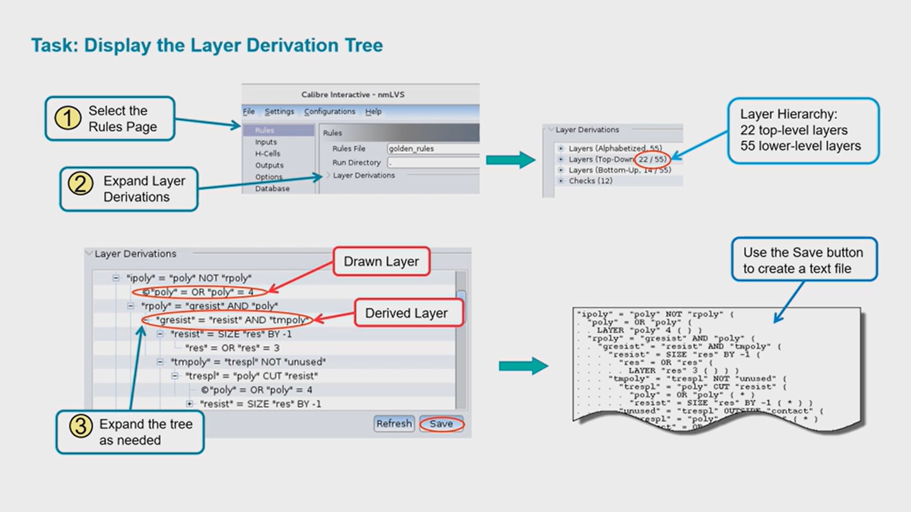
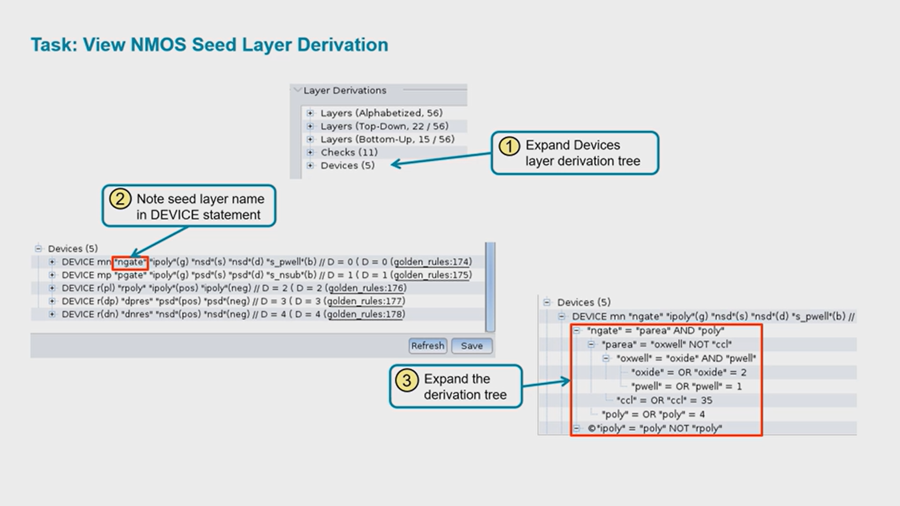
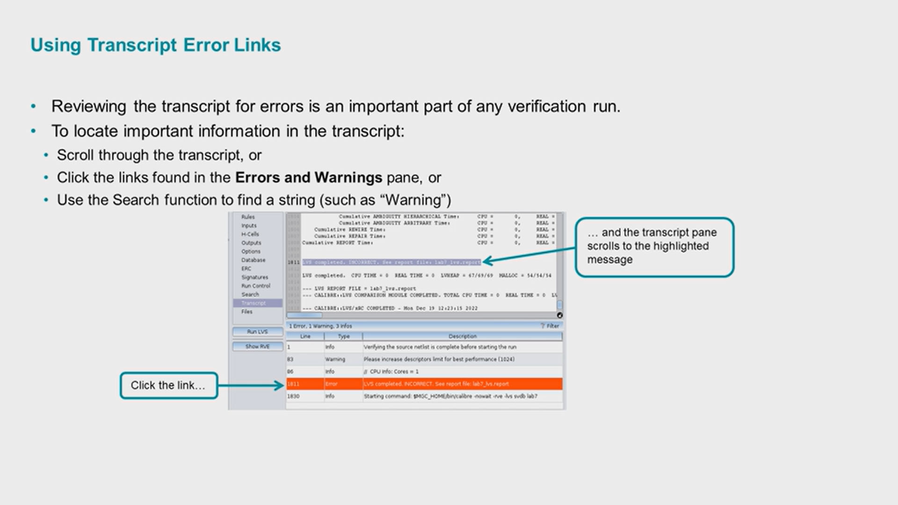
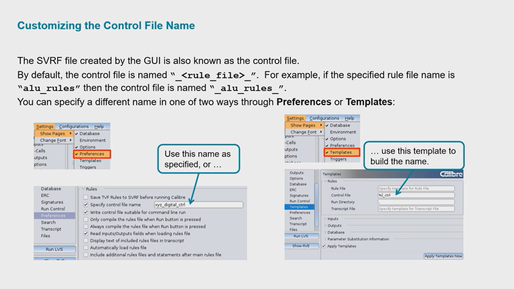
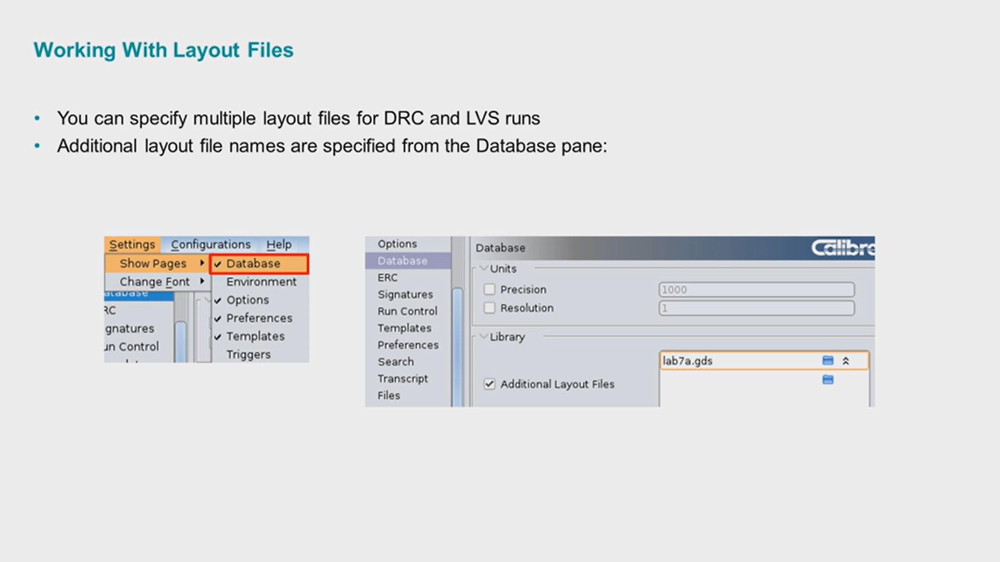
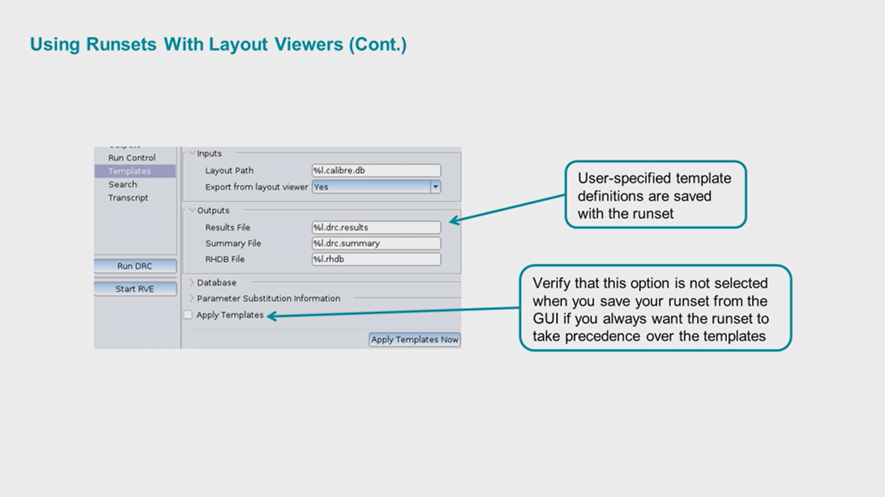

# Chapter 11 — Cell Preservation and Hierarchical Cell Analysis

> **Learning Objectives:** By the end of this chapter, you will be able to:
>
> - Understand why cells are expanded during hierarchical verification
> - Preserve cells containing waived errors
> - Analyze H-Cells for hierarchical LVS optimization
> - Generate and use H-Cell lists
> - Configure pre-execution and post-execution triggers
> - Automate Calibre workflows using trigger scripts

---

## 1. Introduction

As IC designs become larger and more complex, hierarchical verification becomes essential for achieving reasonable runtimes and memory usage.

Calibre provides several mechanisms to improve verification efficiency:

- Cell Preservation
- Error Waivers
- Hierarchical Cell (H-Cell) Analysis
- Pre-Execution Triggers
- Post-Execution Triggers

These features help optimize DRC and LVS runs while maintaining verification accuracy.


---

## 2. Preserving Cells With Error Waivers

When Calibre performs hierarchical DRC, it may automatically expand certain cells to improve runtime efficiency.

Examples include:

- Cells instantiated only once
- Small cells with minimal hierarchy benefit
- Cells determined by runtime heuristics

Because runtime decisions can vary between runs, a cell expanded in one run may remain hierarchical in another.

### Why Is This a Problem?

Suppose:

- Errors inside a cell were waived during a previous DRC run.
- Those waiver records are associated with the hierarchical cell.

If Calibre later expands that cell, the original waiver references may no longer match properly.

To avoid this situation, Calibre allows users to preserve selected cells.



### Preserving Cells

Open:

```text
Options → Preserve Cells
```

You can preserve cells by:

1. Importing cells from an existing RVE waiver file.
2. Specifying additional cell names manually.
3. Combining both methods.

### Benefits

- Maintains waiver consistency
- Prevents unwanted hierarchy expansion
- Improves repeatability between verification runs

> ⚠️ **Warning:** Preserving excessive numbers of cells may increase runtime and memory usage.

---

## 3. Understanding H-Cells

An **H-Cell (Hierarchical Cell)** is a cell that Calibre retains as a reusable hierarchical block during LVS processing.

Instead of flattening every instance repeatedly:

```text
Instance A
Instance B
Instance C
```

Calibre analyzes the cell once and reuses the results.

### Advantages

- Faster LVS execution
- Reduced memory consumption
- Improved scalability for large designs

### Typical H-Cell Candidates

Examples include:

- Standard Cells
- Repeated Analog Blocks
- Memory Macros
- Reusable IP Blocks

---

## 4. H-Cells Analysis

Calibre provides an H-Cells Analysis mode that automatically identifies cells that should remain hierarchical.

### Objective

Determine which cells provide meaningful hierarchy savings.

### Procedure

#### Step 1: Select H-Cells Analysis

Navigate to:

```text
Inputs → Run Type
```

Select:

```text
H-Cells Analysis
```

#### Step 2: Define Candidate Cells

Open:

```text
H-Cells Page
```

Specify:

- Potential H-Cell names
- H-Cell file
- Cell matching options

#### Step 3: Configure Analysis Parameters



Available options include:

### Match Cells By Name

Used when:

```text
Source Cell Name = Layout Cell Name
```

Example:

```text
INV_X1
INV_X1
```

### H-Cells File

Used when source and layout names differ.

Example:

```text
SOURCE_INV  LAYOUT_INV
```

### Hierarchical Savings Threshold

Controls minimum hierarchy benefit required.

Cells below the threshold may be expanded.

### Placement Percentage Threshold

Controls how frequently a cell must appear before it is retained.

---

## 5. Reviewing H-Cell Analysis Results

After running the analysis:

```text
Run H-Cells Analysis
```

Calibre generates evaluation results.



The report includes:

| Column | Description |
|----------|-------------|
| Total Hier Inst Count | Total hierarchical instances |
| Inst Count in Cell | Instances contained within the cell |
| Saved by This Cell | Reduction achieved |
| Potential Remaining Saving | Future savings possible |
| Layout Cell Name | Layout hierarchy name |
| Source Cell Name | Source hierarchy name |

### Example

The analysis may determine:

```text
a1220
```

meets all hierarchy reduction requirements.

Therefore:

```text
a1220
```

is a good H-Cell candidate.

---

## 6. Saving the H-Cell List

Once suitable cells have been identified:

1. Click **Save H-Cells**
2. Generate an H-Cell list file
3. Confirm usage when prompted



Example:

```text
Would you like to use this file as H-Cells file?
```

Select:

```text
Yes
```

Calibre automatically updates:

```text
H-Cells File
```

for subsequent LVS runs.

### Recommended Settings

Enable:

```text
H-Cells File
```

Disable:

```text
Match Cells by Name
```

This ensures the generated H-Cell list drives hierarchy decisions.

---

## 7. Using Pre- and Post-Execution Triggers

Calibre Interactive allows custom programs to execute automatically before and after a verification job.



### Pre-Execution Trigger

Runs before Calibre starts.

Typical uses:

- Environment validation
- File generation
- Variable setup
- Design preparation

### Post-Execution Trigger

Runs after Calibre finishes.

Typical uses:

- Report processing
- Result archiving
- Email notification
- Automation scripts

### Location

```text
Settings → Show Pages → Triggers
```

---

## 8. Trigger Example

Example pre-execution Tcl script:

```tcl
#!/usr/bin/tclsh

puts "My rules are : [lindex $argv 0]"
puts "My layout path is : [lindex $argv 1]"
puts "My run directory is : [lindex $argv 2]"
puts "My layout primary is : [lindex $argv 3]"
```

Example post-execution Tcl script:

```tcl
#!/usr/bin/tclsh

puts "Goodbye."
```



### Arguments Available to Pre-Triggers

| Argument | Description |
|----------|-------------|
| argv[0] | Rule file |
| argv[1] | Layout path |
| argv[2] | Run directory |
| argv[3] | Primary cell |

### Transcript Output

Example:

```text
INFO: Running Process pre-trigger: ./trigger3.tcl

My rules are : golden_rules
My layout path is : lab11a.gds
My run directory is : /root/calibre_drc_lvs/lab5
My layout primary is : lab11a
```

After completion:

```text
INFO: Running Process post-trigger: ./trigger2.tcl

Goodbye.
```

---

## Chapter Summary

| Concept | Key Takeaway |
|----------|-------------|
| Preserve Cells | Prevent hierarchy expansion of selected cells |
| Error Waivers | Maintain consistency across DRC runs |
| H-Cells | Improve LVS performance using hierarchy |
| H-Cells Analysis | Identifies efficient hierarchical cells |
| H-Cells File | Stores reusable H-Cell definitions |
| Pre-Execution Trigger | Runs before Calibre starts |
| Post-Execution Trigger | Runs after Calibre completes |
| Trigger Scripts | Enable workflow automation |

---

## Key Commands and Concepts

```text
Preserve Cells
H-Cells Analysis
H-Cells File
Match Cells by Name
Pre-Execution Trigger
Post-Execution Trigger
Hierarchy Optimization
Error Waivers
```

---

*Next Chapter: Chapter 12 — Advanced Calibre LVS Features*
